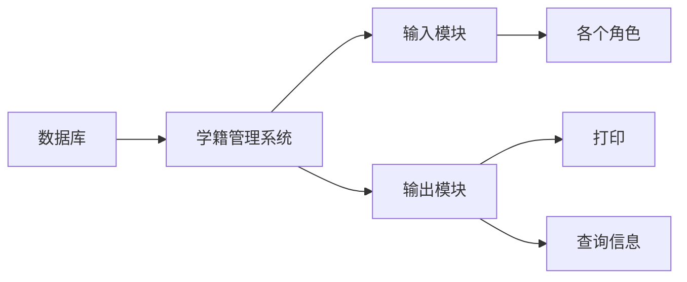
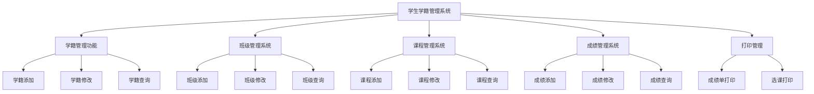

# 
<fond face="宋体" >“学生信息管理系统”可行性研究报告 </fond>

## 一、引言

### 1.1 背景

 
        随着教育信息化的不断推进，学生信息管理的重要性日益凸显。“学生信息管理系统”是一个可以为老师提供管理查看等需求的管理系统，能够帮助老师提高工作效率，减少工作时间。实现信息管理系统化、规范化、自动化，能够减少人力资源的投资。

### 1.2 目的

 
        编写本可行性研究报告的目的是为了更好的管理学生们的学籍信息，了解学生们的相关情况，为管理学生学习和生活进行指导，为学校的统一管理系统奠定基础。通过对学生学籍管理系统项目进行一系列的详细调查研究，明确了该系统项目的实现在技术、经济和社会因素方面的可行性，阐述为了合理地达到项目目标的实现报告，对软件开发中将要面临的问题及其解决方案进行可行性分析。

#### 1.2.1 项目名称：学生信息管理系统

#### 1.2.2 用户：学校的老师和工作人员以及全体学生

#### 1.2.3 项目说明

        传统的学籍管理系统对于教学很重要，它是管理学生的一种手段，是必不可少的。所以学籍管理系统应该能够为用户提供充足的信息和快捷的查询手段。现今学生学籍管理的巨大的数据量给管理人员带来了诸多不便，教学管理缺少一种更加完善、灵活性更强、运行稳定、节省时间、正确率更高的学生学籍管理软件，为了学生档案的管理更加方便快捷，此项目应运而生，能帮助教研人员利用最新的开发工具，快速方便的对学生学籍管理进行管理、输入、输出、查找的所需操作，使散乱的学生档案能够具体化，直观化、合理化。

 
       ==传统的学籍管理方法由于管理不当，易发生数据丢失，速度慢。使用计算机可以高速快捷的完成以上工作。特别是计算机联网后，数据在网上传递，可以实现数据共享，规范教学管理行为，从而提高了管理效率和水平。学籍管理信息系统以计算机为工具，通过对教务管理所需的信息管理，把管理人员从繁琐的数据计算处理中解脱，从而全面提高教学质量。==

        这些优点能极大提高学生档案管理的效率。因此，开发这样一套学籍管理软件是很有必要的。

#### 1.3可行性分析的四个方面

- 技术可行性：使用现有的技术能实现这个系统吗？

- 经济可行性：这个系统的经济效益能超过它的开发成本吗？

- 操作可行性：系统的操作方式在这个用户组织内行得通吗？

- 社会因素可行性：系统开发过程中是否设计各种合同、侵权、责任等与法律、法规吻合或抵触的问题？

#### 1.4参考资料

《软件工程导论（第六版）》张海藩编著 清华大学出版[^1] 

## 二、可行性研究的前提

### 2.1要求

#### 2.1.1功能要求

　　学生学籍管理系统主要用于学校学生学籍的管理，其主要任务是用计算机对学生学籍进行日常管理， 如查询、修改、增加、删除等基本操作。因此，此系统所要完成的功能主要有：学生基础信息管理、学生异动管理、毕业生信息管理等多项管理功能等进行综合管理和快速查询。

#### 2.1.2性能要求　　　　　　　　

        为了能够为用户提供充足的信息和快捷的查询手段，用户使用时系统要保证运行稳定、效率高，能够快速做出响应，迅速处理各项数据、信息，显示出所需信息，所以要有一定的可扩展性和灵活性，尽可能的简化用户的操作。

#### 2.1.3输入、输出要求

- 输入要求：用户可以使用该系统的学生入学、退学、升级等功能；也可以根据所掌握的信息进行人工录入和修改。

- 输出要求：因查询结果可输出为Excel、Word等形式。

#### 2.1.4基本的数据流程和处理流程

#### 2.1.5安全与保密要求

        由于学生信息机密性高，应该对学生的各种信息加以保密，保证系统防火墙的可靠性；由于查询人员的身份和目的不同，系统应该提高不同的查询权限。

### 2.2系统目标
#### 2.2.1模块目标：
1、成绩管理：包括学生成绩管理（课程号、课程名、学号、成绩）的添加、更改、删除和查询（按学号、班级和查询全部）等功能。

2、学籍管理：包括学生基本信息管理。其中学生基本信息管理包括学生基本信息（学生编号、姓名、性别、所在专业等）的添加、更改、删除和查询。

3、班级管理：班级添加、班级修改、班级查询等功能。

4、课程管理：包括课程信息（课程号、课程名称和授课老师）的添加和删除。

5、打印管理：包括输出学生的成绩单和选课情况等。

### 2.3需求分析
#### 2.3.1性能需求
1. 系统响应速度快，能够满足大量用户同时访问的需求。
2. 数据存储安全可靠，防止数据丢失和损坏。
 
#### 2.3.2用户界面需求
1. 界面简洁直观，易于操作。
2. 提供友好的提示信息和错误处理机制。

### 2.4可行性研究方法

        采用的问卷调查的方法：制定出调查问卷，首先在网络上用问卷星发布了调查问卷，同时在本校进行相关调查，在调查过程中，项目组分别与老师、学生等进行了深入的交流与统计，发现他们对现有系统的功能等方面有很多顾虑。所以，问卷调查之后，经过仔细分析需求，项目组及时总结了调查对象的顾虑，针对他们的顾虑，提出了系统的结构分析，最后确定了解决方案。

## 三、技术可行性分析

### 3.1对系统的简要描述

        新系统在原有系统的基础上运用了新的数据库，采取先进的数据库技术与数据管理技术，使数据的准确性与安全性得到了很大的提高，且在用户的并行操作与用户管理方面也有了极大地改善。系统现阶段的发展过程中，利用现有人力和物力是完全具备的能力开发出来的，作为阶段性产品，日后的发展空间大，实现方法逐步简单容易，而且市场上已有基础的管理系统，所以管理系统的技术上是完全可行的。

### 3.2技术架构
1. 选择合适的开发语言和数据库管理系统，如 Java 和 MySQL。
2. 采用 B/S 架构，方便用户通过浏览器访问系统。
 
### 3.3技术难点及解决方案
1. 数据安全问题：采用加密技术、访问控制等措施确保数据安全。
2. 性能优化：优化数据库查询语句、采用缓存技术等提高系统性能。
### 3.4采用新系统可能带来的影响
- ==对设备的影响==
        采用新系统后，改进了原有系统的性能和属性，所以对设备的要求自然更高，系统应该使用先进的技术，设备也必须跟着。

- ==对现有软件的影响==
        新系统采用了先进的数据库技术以及一系列高技术含量软件，使得原来系统上的一些软件无法继续使用，不过新系统将具备一定的软件兼容性。

- ==对用户的影响==
        新的系统在于优化算法让用户拥有更好的体验，但是操作的方式并不会有太大的变化，不会让用户产生陌生感。新系统是在原有的软件基础上进一步的升级与扩展，并且可操作性强，只需要对原来的人员进行简单的培训即可。
- ==对系统运行的影响==
  1.用户操作：将本系统安装在计算机的任意位置，按照指示操作；

  2.源数据的处理：保存后处理；

  3.系统失效的恢复办法：结束当前任务或重新启动计算机。
- ==对运行环境的影响==
        系统设计时考虑到用户使用时，应力求操作简单，查询
 方便，存储快捷，软件设计采用菜单选取方式。
- ==对经费支出的影响==
        因为新系统采用了最新的工具和软件，用户使用时若提高计算机的配置，可把新系统发挥到最高端的状态；不过新系统功能强大，适用于当前的大多操作系统。建议系统是为了改善原有系统在经费支出过高的缺点的，所以新系统一经使用在经费支出方面一定会得到很好的改善，用户在使用了新系统后只需要花一定资金购买一部分计算机与软件就能实现自动化。
技术可行性评价
### 3.5技术可行性评价
 
       当前信息行业发展迅速，基于互联网和Windows操作的系统，在一定的软硬件设备的支持下，有原系统作辅，而且学校大力支持，新系统中的功能目标可以实现；开发人员需要5人，有一定的系统开发经验，校内已有这样的团队，可以满足；预计完成期限五个月，对开发此系统来说已经足够；利用现有的技术在规定的期限内开发工作基本能够完成，所以系统在技术方面是可行的。
## 四、经济可行性分析

### 4.1开发成本
 
1. 硬件设备采购费用。
2. 软件开发费用，包括人员工资、培训费用等。
3. 系统维护费用。
 
### 4.2效益分析
 
1. 提高管理效率，减少人力成本。
2. 提供准确的数据分析，为学校决策提供支持。
3. 增强学校的信息化管理水平，提升学校形象。

## 五、风险分析及应对策略
 
### 5.1技术风险
 
#### 5.1.1技术更新换代快，可能导致系统落后。
- ==应对策略：定期对系统进行升级和维护，关注技术发展动态。==
#### 5.1.2开发过程中可能遇到技术难题，影响项目进度。
- ==应对策略：加强技术团队建设，提前做好技术储备。==
 
### 5.2需求变更风险
 
#### 5.2.1用户需求可能发生变化，导致系统功能需要调整。
- ==应对策略：建立良好的沟通机制，及时了解用户需求变化，进行需求变更管理。==
 
### 5.3安全风险
 
#### 5.3.1系统可能面临网络攻击、数据泄露等安全风险。
- ==应对策略：加强系统安全防护，定期进行安全检测和漏洞修复。==
  
## 六、结论意见
 
       经过研究发现，基本上所有的学校都很需要甚至是依赖学籍管理系统来支持学校工作的日常运行，而本系统具有成本低、方便快捷、操作简单、对于使用者技术要求低等优势，使得学生学籍实现电子化管理，符合社会信息化发展的需要，技术实力达标，在法律方面也可行，有着广阔的前景。

       学生学籍管理系统技术在目前是一个技术上成熟的系统，并且在学校内部准备采取有力措施保证资金和人员配置，本项目方便快捷，投资回报利益大，因此，开发“学生学籍管理系统”的项目是可行的；为了使学校更好的适应现代化高科技产品，符合社会信息化发展的需求，促进学籍管理信息化，不断满足管理人员的要求，争取更好的经济效益，建议立即准备本系统的开发。
 
因此，编写一个学生管理系统可以为学校办公管理提供一个快速、简单规范的管理平台，使学院在学生信息管理方面更加规范化,快捷化。

[^1]:《软件工程导论（第六版）》张海藩编著 清华大学出版

