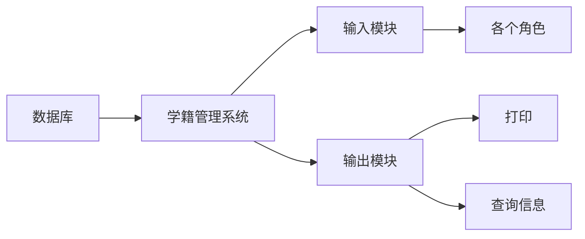
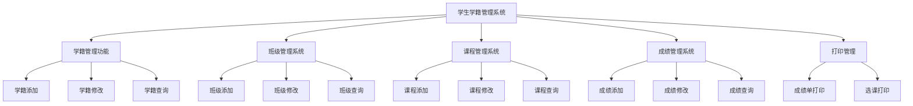

# 
<fond face="宋体" >“学生信息管理系统”可行性研究报告 </fond>

## 一、引言

        随着信息技术的发展，学生信息管理系统已经成为学校管理工作的重要组成部分。在当今教育领域，随着学生数量的不断增加和教育管理要求的日益提高，高效、准确地管理学生信息成为学校管理工作的关键部分。传统的人工管理方式在面对海量学生信息时，存在信息查找困难、更新不及时、容易出错等诸多问题，已经无法满足现代教育管理的需求。

        为了解决学生信息管理系统的不足，为了解决这些问题，开发一个学生信息管理系统具有重要意义。本系统将利用先进的信息技术，为学校提供一个集中化、自动化的学生信息管理平台。通过该系统，学校管理人员、教师等授权用户可以方便快捷地完成学生信息的录入、查询、修改和删除等操作，同时也能够实现对学生信息的统计分析、报表生成等功能，从而提高学生信息管理的效率和质量，为教育决策提供有力的数据支持。

        本项目旨在设计和实现一个功能全面、操作便捷、安全可靠的学生信息管理系统，满足学校在学生管理方面的多样化需求，推动教育管理工作朝着信息化、智能化的方向发展。

### 1.1 背景

 
        随着教育信息化的不断推进，学生信息管理的重要性日益凸显。“学生信息管理系统”是一个可以为老师提供管理查看等需求的管理系统，能够帮助老师提高工作效率，减少工作时间。实现信息管理系统化、规范化、自动化，能够减少人力资源的投资。

### 1.2 目的

 
        编写本可行性研究报告的目的是为了更好的管理学生们的学籍信息，了解学生们的相关情况，为管理学生学习和生活进行指导，为学校的统一管理系统奠定基础。通过对学生学籍管理系统项目进行一系列的详细调查研究，明确了该系统项目的实现在技术、经济和社会因素方面的可行性，阐述为了合理地达到项目目标的实现报告，对软件开发中将要面临的问题及其解决方案进行可行性分析。

#### 1.2.1 项目名称：学生信息管理系统

#### 1.2.2 用户：学校的老师和工作人员以及全体学生

#### 1.2.3 项目说明

        传统的学籍管理系统对于教学很重要，它是管理学生的一种手段，是必不可少的。所以学籍管理系统应该能够为用户提供充足的信息和快捷的查询手段。现今学生学籍管理的巨大的数据量给管理人员带来了诸多不便，教学管理缺少一种更加完善、灵活性更强、运行稳定、节省时间、正确率更高的学生学籍管理软件，为了学生档案的管理更加方便快捷，此项目应运而生，能帮助教研人员利用最新的开发工具，快速方便的对学生学籍管理进行管理、输入、输出、查找的所需操作，使散乱的学生档案能够具体化，直观化、合理化。

 
       ==传统的学籍管理方法由于管理不当，易发生数据丢失，速度慢。使用计算机可以高速快捷的完成以上工作。特别是计算机联网后，数据在网上传递，可以实现数据共享，规范教学管理行为，从而提高了管理效率和水平。学籍管理信息系统以计算机为工具，通过对教务管理所需的信息管理，把管理人员从繁琐的数据计算处理中解脱，从而全面提高教学质量。==

        这些优点能极大提高学生档案管理的效率。因此，开发这样一套学籍管理软件是很有必要的。

#####  1.2.3.1 阶段计划
  ==1、需求调研阶段（第 1 - 2 周）==

• 与学校各部门（教务处、学生处、班主任等）沟通，了解他们对学生信息管理的具体需求，包括需要管理的学生信息种类（如基本信息、成绩、考勤等）。
• 分析不同用户角色（管理员、教师、辅导员等）的功能需求，如管理员的全面管理权限、教师对所教班级学生信息的查询和成绩录入权限。
• 收集对系统性能、安全性、易用性方面的期望，如系统响应时间、数据加密需求、操作界面简洁性要求。
• 整理需求文档，明确系统功能边界和非功能需求。

==2、设计阶段（第 3 - 4 周）==

• 总体架构设计（第 3 周）
• 根据需求确定系统采用的架构模式，如 B/S 架构。
• 规划系统的模块划分，包括用户管理、学生信息管理、课程管理、成绩管理等模块，明确各模块之间的接口。
• 数据库设计（第 3 - 4 周）
• 根据信息种类设计数据库表结构，如学生表（学号、姓名、性别、出生日期、班级等）、成绩表（学号、课程号、成绩等）。
• 确定表之间的关系（如学生表与成绩表通过学号关联），设计合适的索引提高查询效率。
• 规划数据库的存储策略，考虑数据量增长后的扩展性。
• 界面设计（第 4 周）
• 设计系统的登录界面、主界面和各功能模块的操作界面，保证界面简洁美观、易于操作。
• 设计交互流程，如点击菜单弹出相应功能页面、信息查询的输入输出方式。

==3、开发阶段（第 5 - 8 周）==

• 前端开发（第 5 - 6 周）
• 根据界面设计，使用 HTML、CSS、JavaScript 等技术开发前端页面，实现用户交互功能。
• 与后端开发人员沟通，确定数据交互接口，保证前端页面与后端服务的兼容性。
• 后端开发（第 5 - 8 周）
• 使用选定的编程语言（如 Python、Java 等）和框架开发后端服务，实现用户管理、学生信息管理等功能模块。
• 开发数据库访问层，实现对数据库的增删改查操作，确保数据的完整性和一致性。
• 进行单元测试，对每个功能模块和接口进行测试，修复发现的问题。

==4、测试阶段（第 9 - 10 周）==

• 系统测试（第 9 周）
• 进行集成测试，将前端和后端系统整合，测试整个系统的功能完整性和稳定性。
• 对系统进行性能测试，检查系统在大量数据和高并发情况下的响应时间和资源占用情况。
• 进行安全测试，检查系统的用户认证、授权和数据加密机制是否可靠。
• 用户验收测试（第 10 周）
• 邀请学校相关用户（管理员、教师等）对系统进行试用，收集用户反馈和问题。
• 根据用户反馈对系统进行优化和调整，确保系统满足用户需求。

==5、部署与维护阶段（第 11 周及以后）==

• 系统部署（第 11 周）
• 在学校的服务器环境中部署系统，配置服务器参数、数据库连接等。
• 对系统进行最后的测试和验证，确保系统在生产环境中正常运行。
• 系统维护（第 11 周及以后）
• 建立系统维护机制，及时处理用户反馈的问题和系统故障。
• 根据学校的发展和需求变化，对系统进行功能更新和优化。

##### 1.2.3.2 人员组成
1. 项目经理

• 负责整个项目的规划、执行和监控。协调各方资源，制定项目计划和里程碑，把控项目进度、质量和成本，及时处理项目开发过程中的风险和问题，确保项目顺利交付。

2. 系统分析师

• 与学校相关部门沟通，详细了解学生信息管理的业务流程和需求。将业务需求转化为系统功能需求和非功能需求，撰写需求规格说明书，为系统设计提供依据，并参与系统设计评审，确保设计符合需求。

3. 架构师

• 根据需求设计系统的整体架构，包括软件架构模式、技术选型、模块划分及模块间的接口设计。指导开发团队进行系统开发，保证系统的高性能、高可用性、可扩展性和可维护性，参与关键技术问题的解决。

4. 数据库设计师

• 负责数据库的设计工作，根据系统功能需求创建数据库模型，包括设计数据表结构、确定数据关系、索引和存储过程等。优化数据库性能，确保数据的高效存储和访问，并协助开发人员进行数据库相关的开发和调试。

5. 开发工程师（前端）

• 依据系统设计和界面设计文档，使用 HTML、CSS、JavaScript 等前端技术开发用户界面。实现页面的交互功能，与后端开发人员协作完成数据交互，优化前端性能，保证页面在不同设备和浏览器上的兼容性。

6. 开发工程师（后端）

• 使用选定的编程语言（如 Python、Java 等）和相应的开发框架，实现系统的业务逻辑功能，包括用户管理、学生信息管理、课程管理、成绩管理等模块。开发与数据库的交互层，确保数据的准确存储和获取，并进行单元测试和代码优化。

7. 测试工程师

• 制定测试计划和测试用例，对系统进行全面测试，包括功能测试、性能测试、安全测试等。记录和跟踪测试过程中发现的缺陷，协助开发人员定位和修复问题，确保系统质量符合要求。

8. 文档编写员

• 负责编写项目相关的文档，包括用户手册、安装手册、技术文档等。确保文档内容准确、清晰，易于理解，为系统的使用、维护和后续开发提供支持。

9. 运维工程师

• 在系统部署阶段，负责将系统部署到生产环境中，配置服务器、网络等相关环境参数。在系统运行期间，监控系统的运行状态，及时处理系统故障和性能问题，保障系统的稳定运行，并协助进行系统的升级和维护工作。

##### 1.2.3.3 项目成本

- 硬件成本：服务器、网络、存储设备等硬件设备的购买、安装、调试、维护等成本。

- 软件成本：软件开发、测试、部署、维护等软件的购买、安装、调试、维护等成本。

- 人力成本：项目经理、系统分析师、架构师、数据库设计师、开发工程师、测试工程师、文档编写员、运维工程师等人员的培训、熟练度、薪酬等费用。

- 管理费用：项目管理费用、软件授权费用、软件保修费用、服务器租用费用等费用。

- 其他费用：其他费用，如办公费、保险费、税费等。

- 总成本：硬件成本+软件成本+人力成本+管理费用+其他费用。

##### 1.2.3.4 安排进度
| 阶段 | 时间跨度 | 具体周次 | 主要任务 | 交付成果 |
| :---: | :---: | :---: | :---: | :---: |
| 项目启动与需求调研 | 第1 - 2周 | 第1周 | 组建项目团队，明确成员角色与职责；召开项目启动会议，介绍项目目标、范围和计划；收集相关资料，如学校现有的学生信息管理流程、文档等。 | 项目团队组建名单、项目启动会议纪要、收集的相关资料清单 |
|  |  | 第2周 | 与学校各部门（教务处、学生处、教师代表等）进行访谈，深入了解他们对学生信息管理系统的功能需求和期望；分析不同用户角色（管理员、教师、辅导员等）在系统中的操作权限和业务流程；完成需求调研报告初稿。 | 需求调研报告初稿 |
| 系统设计 | 第3 - 5周 | 第3周 | 对需求调研报告进行评审和完善，确定最终的系统需求规格；架构师进行系统总体架构设计，包括选择合适的架构模式（如三层架构或微服务架构），确定系统的模块划分和各模块之间的接口；数据库设计师开始设计数据库结构，确定主要的数据表、表之间的关系以及数据的存储方式。 | 完善后的需求规格文档、系统总体架构设计初稿、数据库结构设计初稿 |
|  |  | 第4周 | 完成系统架构设计文档，包括架构图、技术选型说明等，并组织团队进行评审；数据库设计细化，设计数据库的存储过程、视图和索引等，提高数据库的查询和操作效率；界面设计师根据系统功能需求，设计系统的用户界面原型，包括登录界面、主操作界面和各个功能模块的详细界面。 | 系统架构设计评审通过的文档、细化后的数据库设计文档、用户界面原型设计稿 |
|  |  | 第5周 | 对数据库设计和界面设计进行评审，根据评审意见进行修改和完善；制定系统开发的详细技术规范和编码规范，确保开发过程的一致性和规范性。 | 评审通过的数据库设计文档、界面设计文档、系统开发技术规范和编码规范文档 |
| 系统开发 | 第6 - 12周 | 第6 - 8周 | 前端开发工程师根据界面设计原型，使用HTML、CSS、JavaScript等技术进行前端页面开发，实现页面的布局、交互效果和数据展示功能；后端开发工程师按照系统架构和技术规范，使用选定的编程语言（如Java、Python等）和开发框架，实现系统的业务逻辑功能，包括用户管理、学生信息录入、查询、修改和删除等功能模块；开发过程中，进行单元测试，确保每个功能模块的代码质量和正确性。 | 前端页面开发阶段性成果、后端功能模块开发阶段性成果、单元测试报告 |
|  |  | 第9 - 10周 | 前端和后端开发人员进行联调，将前端页面与后端服务进行集成，解决接口调用和数据交互问题；对集成后的系统进行初步的功能测试，验证系统是否满足需求规格中的功能要求，记录并修复发现的问题。 | 前端后端联调报告、初步功能测试报告及修复记录 |
|  |  | 第11 - 12周 | 继续完善系统功能，处理功能测试中发现的遗留问题，优化系统性能，提高系统的响应速度和稳定性；开发系统的安全机制，包括用户认证、授权和数据加密功能，确保系统数据的安全性。 | 完善后的系统功能、优化后的系统性能指标、系统安全机制开发成果 |
| 系统测试 | 第13 - 14周 | 第13周 | 测试工程师制定详细的测试计划和测试用例，对系统进行全面的功能测试，包括边界值测试、异常情况测试等，确保系统功能的完整性和稳定性；进行性能测试，模拟大量用户并发访问系统的情况，检查系统的响应时间、资源占用情况，对性能瓶颈进行优化；开展安全测试，检查系统是否存在安全漏洞，如SQL注入、跨站脚本攻击等，及时修复发现的安全问题。 | 测试计划、测试用例、功能测试报告、性能测试报告、安全测试报告及修复记录 |
|  |  | 第14周 | 根据测试结果，整理和分析测试报告，与开发团队一起确定需要修复的问题和优化的方向；开发团队对测试中发现的问题进行修复和优化，完成后重新提交给测试团队进行回归测试，确保问题得到有效解决。 | 整理分析后的测试报告、回归测试报告 |
| 系统部署与培训 | 第15 - 16周 | 第15周 | 运维工程师在学校的服务器环境中部署系统，配置服务器参数、数据库连接、网络设置等，确保系统能够正常运行；对部署后的系统进行最后的验收测试，确保系统在生产环境中满足用户的需求和期望。 | 系统部署文档、验收测试报告 |
|  |  | 第16周 | 为学校的管理员、教师等相关用户提供系统使用培训，包括系统功能介绍、操作流程演示、常见问题解答等，确保用户能够熟练使用系统；整理项目文档，包括需求文档、设计文档、测试文档、用户手册等，形成完整的项目文档资料，交付给学校。 | 培训资料、完整的项目文档资料 |
| 项目验收与维护 | 第17周 | 第17周 | 与学校相关部门共同进行项目验收，确认系统是否达到预期目标，验收通过后签署项目验收报告；项目团队将系统正式移交给学校的运维团队，并提供一定期限的售后维护服务，处理系统运行过程中出现的问题和用户反馈。 | 项目验收报告、售后维护服务安排说明 |

#### 1.3可行性分析的四个方面

- 技术可行性：使用现有的技术能实现这个系统吗？

- 经济可行性：这个系统的经济效益能超过它的开发成本吗？

- 操作可行性：系统的操作方式在这个用户组织内行得通吗？

- 社会因素可行性：系统开发过程中是否设计各种合同、侵权、责任等与法律、法规吻合或抵触的问题？

#### 1.4参考资料

《软件工程导论（第六版）》张海藩编著 清华大学出版[^1] 

## 二、可行性研究的前提

### 2.1要求

#### 2.1.1功能要求

　　学生学籍管理系统主要用于学校学生学籍的管理，其主要任务是用计算机对学生学籍进行日常管理， 如查询、修改、增加、删除等基本操作。因此，此系统所要完成的功能主要有：学生基础信息管理、学生异动管理、毕业生信息管理等多项管理功能等进行综合管理和快速查询。

#### 2.1.2性能要求　　　　　　　　

        为了能够为用户提供充足的信息和快捷的查询手段，用户使用时系统要保证运行稳定、效率高，能够快速做出响应，迅速处理各项数据、信息，显示出所需信息，所以要有一定的可扩展性和灵活性，尽可能的简化用户的操作。

#### 2.1.3输入、输出要求

- 输入要求：用户可以使用该系统的学生入学、退学、升级等功能；也可以根据所掌握的信息进行人工录入和修改。

- 输出要求：因查询结果可输出为Excel、Word等形式。

#### 2.1.4基本的数据流程和处理流程

#### 2.1.5安全与保密要求

        由于学生信息机密性高，应该对学生的各种信息加以保密，保证系统防火墙的可靠性；由于查询人员的身份和目的不同，系统应该提高不同的查询权限。

### 2.2系统目标
#### 2.2.1模块目标：
1、成绩管理：包括学生成绩管理（课程号、课程名、学号、成绩）的添加、更改、删除和查询（按学号、班级和查询全部）等功能。

2、学籍管理：包括学生基本信息管理。其中学生基本信息管理包括学生基本信息（学生编号、姓名、性别、所在专业等）的添加、更改、删除和查询。

3、班级管理：班级添加、班级修改、班级查询等功能。

4、课程管理：包括课程信息（课程号、课程名称和授课老师）的添加和删除。

5、打印管理：包括输出学生的成绩单和选课情况等。

### 2.3需求分析
#### 2.3.1性能需求
1. 系统响应速度快，能够满足大量用户同时访问的需求。
2. 数据存储安全可靠，防止数据丢失和损坏。
 
#### 2.3.2用户界面需求
1. 界面简洁直观，易于操作。
2. 提供友好的提示信息和错误处理机制。

### 2.4可行性研究方法

        采用的问卷调查的方法：制定出调查问卷，首先在网络上用问卷星发布了调查问卷，同时在本校进行相关调查，在调查过程中，项目组分别与老师、学生等进行了深入的交流与统计，发现他们对现有系统的功能等方面有很多顾虑。所以，问卷调查之后，经过仔细分析需求，项目组及时总结了调查对象的顾虑，针对他们的顾虑，提出了系统的结构分析，最后确定了解决方案。

## 三、技术可行性分析

### 3.1对系统的简要描述

        新系统在原有系统的基础上运用了新的数据库，采取先进的数据库技术与数据管理技术，使数据的准确性与安全性得到了很大的提高，且在用户的并行操作与用户管理方面也有了极大地改善。系统现阶段的发展过程中，利用现有人力和物力是完全具备的能力开发出来的，作为阶段性产品，日后的发展空间大，实现方法逐步简单容易，而且市场上已有基础的管理系统，所以管理系统的技术上是完全可行的。

### 3.2技术架构
1. 选择合适的开发语言和数据库管理系统，如 Java 和 MySQL。
2. 采用 B/S 架构，方便用户通过浏览器访问系统。
 
### 3.3技术难点及解决方案
1. 数据安全问题：采用加密技术、访问控制等措施确保数据安全。
2. 性能优化：优化数据库查询语句、采用缓存技术等提高系统性能。
### 3.4采用新系统可能带来的影响
- ==对设备的影响==
        采用新系统后，改进了原有系统的性能和属性，所以对设备的要求自然更高，系统应该使用先进的技术，设备也必须跟着。

- ==对现有软件的影响==
        新系统采用了先进的数据库技术以及一系列高技术含量软件，使得原来系统上的一些软件无法继续使用，不过新系统将具备一定的软件兼容性。

- ==对用户的影响==
        新的系统在于优化算法让用户拥有更好的体验，但是操作的方式并不会有太大的变化，不会让用户产生陌生感。新系统是在原有的软件基础上进一步的升级与扩展，并且可操作性强，只需要对原来的人员进行简单的培训即可。
- ==对系统运行的影响==
  1.用户操作：将本系统安装在计算机的任意位置，按照指示操作；

  2.源数据的处理：保存后处理；

  3.系统失效的恢复办法：结束当前任务或重新启动计算机。
- ==对运行环境的影响==
        系统设计时考虑到用户使用时，应力求操作简单，查询
 方便，存储快捷，软件设计采用菜单选取方式。
- ==对经费支出的影响==
        因为新系统采用了最新的工具和软件，用户使用时若提高计算机的配置，可把新系统发挥到最高端的状态；不过新系统功能强大，适用于当前的大多操作系统。建议系统是为了改善原有系统在经费支出过高的缺点的，所以新系统一经使用在经费支出方面一定会得到很好的改善，用户在使用了新系统后只需要花一定资金购买一部分计算机与软件就能实现自动化。
技术可行性评价
### 3.5技术可行性评价
 
       当前信息行业发展迅速，基于互联网和Windows操作的系统，在一定的软硬件设备的支持下，有原系统作辅，而且学校大力支持，新系统中的功能目标可以实现；开发人员需要5人，有一定的系统开发经验，校内已有这样的团队，可以满足；预计完成期限五个月，对开发此系统来说已经足够；利用现有的技术在规定的期限内开发工作基本能够完成，所以系统在技术方面是可行的。
## 四、经济可行性分析

### 4.1开发成本
 
1. 硬件设备采购费用。
2. 软件开发费用，包括人员工资、培训费用等。
3. 系统维护费用。
 
### 4.2效益分析
 
1. 提高管理效率，减少人力成本。
2. 提供准确的数据分析，为学校决策提供支持。
3. 增强学校的信息化管理水平，提升学校形象。

## 五、风险分析及应对策略
 
### 5.1技术风险
 
#### 5.1.1技术更新换代快，可能导致系统落后。
- ==应对策略：定期对系统进行升级和维护，关注技术发展动态。==
#### 5.1.2开发过程中可能遇到技术难题，影响项目进度。
- ==应对策略：加强技术团队建设，提前做好技术储备。==
 
### 5.2需求变更风险
 
#### 5.2.1用户需求可能发生变化，导致系统功能需要调整。
- ==应对策略：建立良好的沟通机制，及时了解用户需求变化，进行需求变更管理。==
 
### 5.3安全风险
 
#### 5.3.1系统可能面临网络攻击、数据泄露等安全风险。
- ==应对策略：加强系统安全防护，定期进行安全检测和漏洞修复。==
  

## 六、支持条件

### 6.1、硬件支持条件
1. 服务器
• 处理器：至少为多核处理器（如Intel Xeon系列或等效的AMD处理器），主频[X]GHz以上，以保证系统能够高效处理大量并发请求和数据操作。
• 内存：建议配置[X]GB及以上的内存，以满足系统运行时数据缓存和多任务处理的需求，尤其是在处理大规模学生信息数据时。
• 存储：配备大容量硬盘或存储阵列，总容量根据预计存储的学生信息量确定，需考虑数据增长因素，可采用RAID技术保障数据的冗余和可靠性。
2. 客户端设备

• 普通PC或笔记本电脑，处理器主频[X]GHz以上，内存[X]GB以上，能够流畅运行操作系统和支持的浏览器。

• 网络连接设备（如网卡）应具备稳定的网络连接能力，支持[网络协议类型，如TCP/IP]协议，确保与服务器之间的数据传输顺畅。

### 6.2、软件支持条件

1. 服务器端软件
• 操作系统：可选用Windows Server（[版本号]及以上）或Linux（如Ubuntu、CentOS等主流发行版），操作系统应具备稳定、安全和易于管理的特点，支持多用户、多进程并发操作。
• 数据库管理系统：推荐使用MySQL（[版本号]及以上）、Oracle（[版本号]及以上）或SQL Server（[版本号]及以上）等专业数据库管理系统，以提供高效的数据存储、检索和管理功能，支持复杂的查询、事务处理和数据完整性约束。
• Web服务器（若采用B/S架构）：如Apache HTTP Server（[版本号]及以上）或Nginx（[版本号]及以上），用于处理客户端的HTTP请求，提供静态和动态网页内容的服务，具备高性能、高并发处理能力和良好的安全性。

2. 客户端软件
• 操作系统：支持Windows（[版本号]及以上）、macOS（[版本号]及以上）或Linux（主流桌面发行版）等常见操作系统，确保系统具有广泛的兼容性。
• 浏览器：推荐使用Google Chrome（[版本号]及以上）、Mozilla Firefox（[版本号]及以上）或Microsoft Edge（[版本号]及以上）等现代浏览器，这些浏览器应支持HTML5、CSS3和JavaScript等最新的Web技术标准，以保证系统界面的正常显示和交互功能的实现。

### 6.3、网络支持条件

1. 网络带宽
• 服务器端应具备足够的网络带宽，以满足学校内部用户（管理员、教师等）同时访问系统的需求。对于小型学校（学生人数[X]以下），建议接入带宽不低于[X]Mbps；对于中型学校（学生人数[X - X]），接入带宽不低于[X]Mbps；大型学校（学生人数[X]以上）则需要更高的带宽，可根据实际用户数量和使用情况进行评估和调整。

2. 网络稳定性
• 网络应具备高稳定性，网络设备（如路由器、交换机等）应采用冗余配置，以减少单点故障的影响。网络服务提供商应保证网络的可用性，确保系统在正常教学和管理期间能够持续稳定运行，网络故障率应低于[X]%。

3. 网络安全

• 部署防火墙、入侵检测系统（IDS）或入侵防御系统（IPS）等网络安全设备，防止外部网络攻击，保护学生信息的安全。采用VPN（虚拟专用网络）技术（若有远程访问需求），保障远程用户与校内网络之间的安全连接。

### 6.4、其他支持条件

1. 电力供应

• 服务器机房应配备可靠的不间断电源（UPS）系统，以防止因电力故障导致系统突然关机，UPS应能够在停电情况下为服务器和关键网络设备持续供电[X]分钟以上，确保数据的完整性和系统的正常关闭。

2. 环境条件

• 服务器机房应保持适宜的温度（[温度范围]）和湿度（[湿度范围]），配备空调系统和湿度调节设备，避免因环境因素对服务器硬件造成损坏。同时，机房应具备良好的防尘、防静电措施，减少硬件故障的发生概率。

3. 维护与技术支持

• 学校应配备专业的系统维护人员或与技术支持服务商合作，定期对系统进行维护、升级和故障排除。维护人员应熟悉系统的架构、软件和硬件配置，能够及时处理系统运行过程中出现的问题，保障系统的持续可用性。同时，应建立完善的技术支持流程和响应机制，确保在出现紧急情况时能够快速响应并解决问题。
## 七、结论意见
 
       经过研究发现，基本上所有的学校都很需要甚至是依赖学籍管理系统来支持学校工作的日常运行，而本系统具有成本低、方便快捷、操作简单、对于使用者技术要求低等优势，使得学生学籍实现电子化管理，符合社会信息化发展的需要，技术实力达标，在法律方面也可行，有着广阔的前景。

       学生学籍管理系统技术在目前是一个技术上成熟的系统，并且在学校内部准备采取有力措施保证资金和人员配置，本项目方便快捷，投资回报利益大，因此，开发“学生学籍管理系统”的项目是可行的；为了使学校更好的适应现代化高科技产品，符合社会信息化发展的需求，促进学籍管理信息化，不断满足管理人员的要求，争取更好的经济效益，建议立即准备本系统的开发。
 
因此，编写一个学生管理系统可以为学校办公管理提供一个快速、简单规范的管理平台，使学院在学生信息管理方面更加规范化,快捷化。

[^1]:《软件工程导论（第六版）》张海藩编著 清华大学出版

