# <center><fond face="宋体" >“学生信息管理系统”软件详细说明书 </fond></center>

## 一、引言

### 1.1 编写目的
<p>        学生信息管理系统是一款专为教育机构优化学生信息管理的软件应用。本文详细解读了系统的核心组成部分，包括基本信息管理、档案管理、学生成绩管理等模块。系统的自动化和数据安全功能，提高了管理效率，减少了错误，并支持教学决策和家校互动。</p>

### 1.2 系统概述
<p>        学生信息管理系统（Student Information System, SIS）是现代教育机构用于管理学生数据的核心技术平台。它通过集中的数据存储，为教育工作者、学生及其家长提供方便的数据访问和处理功能。该系统不仅覆盖学生的基本信息管理，还涉及学籍档案、成绩管理、家校互动等多个方面。</p>

### 1.3 系统功能与特点
- 数据集中管理 ：所有的学生信息、成绩、档案等数据都集中在一个平台上，便于统一管理和访问。
- 自动化工作流程 ：能够自动执行诸如成绩录入、注册、报告生成等常规任务，减少人工操作，提高效率。
- 安全性和隐私保护 ：采用先进的安全措施和技术，确保数据在存储和传输过程中的安全。
- 用户友好的界面 ：提供直观易用的用户界面，无论是管理员、教师还是学生家长，都可以轻松操作。
- 高度可扩展性 ：支持随时根据学校需求添加新的模块或功能，满足不同教育机构的需求。

### 1.5 系统设计目标
1. 高效性：快速处理大量学生信息的录入、查询、修改和删除操作。
2. 准确性：确保学生信息的完整性和正确性，避免数据错误。
3. 易用性：为不同用户角色（管理员、教师、学生）提供简洁直观的操作界面。
4. 安全性：保护学生信息不被非法访问和篡改。

## 二、系统组成

### 2.1 程序系统的结构
以下是一份更详细的学生信息管理系统程序层次结构表的 Markdown 格式：
|层次|模块名称|功能描述|
|:--:|:--:|:--:|
|1|用户交互层|
| | | - 提供美观、易用的可视化界面，适配不同的设备屏幕尺寸，确保在桌面端、移动端都能正常显示和操作。<br>
| | | - 登录界面：包含用户名和密码输入框，支持记住密码功能，有登录和找回密码按钮。登录按钮点击后验证用户输入信息的合法性，与后端服务器交互进行身份验证。找回密码功能可通过预留的邮箱或手机号重置密码。==层次图如图A所示==。<br>
| | | - 主菜单界面：采用清晰的布局，如侧边栏或顶部导航栏形式。菜单选项包括学生信息管理、班级信息管理、课程信息管理、成绩信息管理等功能入口。每个入口有明确的图标指示，方便用户快速识别和操作。|
|2|业务逻辑层|
| |学生信息处理| - 添加学生资料：允许管理员或授权用户输入学生的基本信息，如学号（系统自动生成或手动输入，需保证唯一性）、姓名、性别、出生日期、民族、籍贯、家庭住址、家长联系方式等。对输入信息进行格式和合法性检查，例如学号长度和格式、日期格式、电话号码格式等。==层次图如图B所示==<br>
| | | - 修改学生资料：根据学号或其他唯一标识检索学生信息，可修改除学号外的其他信息。修改后的数据要及时更新到数据库，并记录修改日志，包括修改人、修改时间和修改内容。<br>
| | | - 删除学生资料：确认删除操作后，从数据库中彻底删除学生记录。删除前需检查该学生是否存在关联数据（如成绩、班级信息等），若有则提示用户先处理相关联的数据或自动处理关联关系（如删除成绩记录等）。<br>
| | | - 查询学生资料：提供多种查询方式，如按学号精确查询、按姓名模糊查询、按班级查询、按出生日期范围查询等。查询结果以列表形式展示，可点击查看详细信息，并且支持导出查询结果为 Excel 或 PDF 文件。<br>
| |班级管理| - 班级创建：输入班级名称、年级、专业（如果有）、班主任信息（可从教师列表中选择）等创建新班级。班级名称要符合命名规范，年级信息要与学校的年级体系一致，班主任必须是系统中已存在的教师。<br>
| | | - 班级修改：可修改班级名称、班主任等信息。修改班级名称时要检查是否与其他班级重名，修改班主任要更新班级与教师的关联关系。<br>
| | | - 班级删除：删除班级前需检查班级内是否有学生，若有则提示用户先将学生转移到其他班级或自动将学生从该班级移除。删除班级后，相关的班级与学生、课程等关联信息也需相应处理。<br>
| | | - 学生班级分配管理：支持单个或批量将学生分配到班级，同时也可以将学生从某个班级移除。分配过程中要更新学生和班级的关联表，确保数据的一致性。<br>
| |课程管理| - 课程添加：输入课程名称、课程代码（唯一）、学分、课程类型（必修、选修等）、授课教师（可从教师列表中选择）、课程大纲等信息创建新的课程。课程代码要符合编码规则，学分要在合理范围内，授课教师必须是已注册且有授课资格的教师。<br>
| | | - 课程编辑：修改课程的各种信息，如课程名称、学分、授课教师等。修改课程代码时要确保新代码的唯一性，修改授课教师要更新教师与课程的关联关系。<br>
| | | - 课程删除：删除课程前要检查是否有学生已经选修该课程，若有则提示用户如何处理（如取消学生选课记录或重新安排课程），删除后要清理与该课程相关的所有数据，包括课程与教师、学生的关联信息。<br>
| | | - 课程关联教师：除了在课程创建和编辑时关联教师外，还应支持单独调整课程的授课教师，确保每个课程都有合适的教师授课，同时教师所授课程数量不能超过其教学能力范围。<br>
| |成绩管理| - 成绩录入：教师可以按课程或班级为单位录入学生成绩。成绩录入界面要清晰显示学生名单和对应的成绩输入框，支持手动输入和批量导入（如从 Excel 文件导入）成绩。录入成绩时要对数据进行合法性检查，如成绩范围是否在 0 - 100 分之间（或根据学校的评分标准）。<br>
| | | - 成绩更新：教师可以修改已录入的成绩，但要记录成绩修改的历史，包括修改人、修改时间、修改前和修改后的成绩。同时，更新成绩后要重新计算相关的统计数据（如平均分、总分等）。<br>
| | | - 成绩统计：自动计算每个学生的总分、平均分，每个课程的平均分、最高分、最低分、及格率等统计数据。可以按班级、年级、课程等维度进行成绩统计分析，并以图表（如柱状图、折线图等）或表格形式展示统计结果。<br>
| | | - 成绩查询：学生可以查询自己的成绩，教师和管理员可以查询指定学生或班级、课程的成绩。查询结果要显示详细的成绩信息，包括课程名称、成绩、学分等，并且支持打印或导出查询结果。|
|3|数据访问层|
| |学生数据操作| - 与存储学生信息的数据表进行交互，包括插入新学生记录、更新学生信息、删除学生记录以及查询学生数据等操作。<br>
| | | - 插入操作要确保数据的完整性和准确性，根据数据库设计的字段要求插入相应的值。<br>
| | | - 更新操作要根据传入的学生标识（如学号）准确更新对应的字段值，同时处理好并发情况下的数据一致性问题。<br>
| | | - 查询操作要根据不同的查询条件（如学号、姓名等）构建合适的 SQL 查询语句，从数据库中获取准确的学生数据，并将结果以合适的格式返回给业务逻辑层。<br>
| |班级数据操作| - 读写班级相关数据表，执行班级创建、修改、删除以及查询班级信息等操作。<br>
| | | - 在创建班级时，向班级表中插入新的班级记录，同时处理好与其他相关表（如教师表、学生班级关联表）的关联关系插入。<br>
| | | - 修改班级信息时，准确更新班级表中的相应字段，并同步更新相关联表中的信息。<br>
| | | - 查询班级信息可以根据班级名称、年级、班主任等条件进行查询，将查询到的班级信息返回给业务逻辑层，用于展示或其他处理。<br>
| |课程数据操作| - 对课程数据表进行增删改查操作。<br>
| | | - 添加课程时，将课程的各项信息插入到课程表中，包括课程名称、代码、学分等，并建立与授课教师的关联记录。<br>
| | | - 修改课程信息时，更新课程表中的相应字段，同时处理好课程与教师、学生等关联关系的变化。<br>
| | | - 删除课程时，从课程表中删除课程记录，并清理与该课程相关的所有关联数据。<br>
| | | - 查询课程数据可根据课程名称、代码、授课教师等条件进行查询，获取课程详细信息。<br>
| |成绩数据操作| - 存储学生成绩数据到成绩表中，包括学生学号、课程代码、成绩等信息。<br>
| | | - 在录入或更新成绩时，准确地将成绩数据插入或更新到成绩表中，确保数据的一致性。<br>
| | | - 查询成绩数据可以根据学生、课程、班级等条件进行查询，为成绩管理模块提供数据支持。|
|4|数据库层|
| | | - 存储学生信息的数据表结构设计包含学号（主键）、姓名、性别、出生日期、民族、籍贯、家庭住址、家长联系方式等字段，每个字段都有相应的数据类型和约束条件。<br>
| | | - 班级数据表存储班级相关信息，包括班级编号（主键）、班级名称、年级、专业、班主任编号等字段，通过班级编号与其他表建立关联。<br>
| | | - 课程数据表包含课程编号（主键）、课程名称、课程代码、学分、课程类型、授课教师编号等字段，用于存储课程的详细信息和关联授课教师。<br>
| | | - 成绩数据表设计有成绩编号（主键）、学生学号、课程代码、成绩、录入时间等字段，用于存储学生的成绩信息，通过学生学号和课程代码与其他表建立关联。<br>
| | | - 此外，还有用于存储教师信息的教师表、学生班级关联表等，这些表共同构成了学生信息管理系统的数据库，保证数据的存储和管理。|

#### 2.1.1 学生登录层次图（图A）
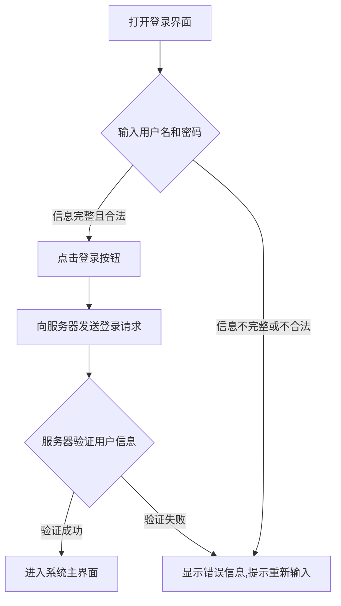


#### 2.1.2 学生信息管理层次图(图B)
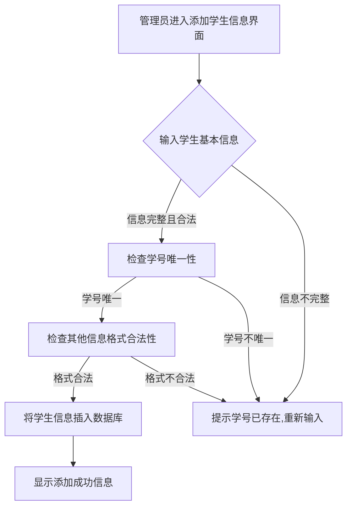

## 三、基本信息管理模块

### 3.1 功能模块（流程图） 
1、学籍管理：包括学生基本信息管理。
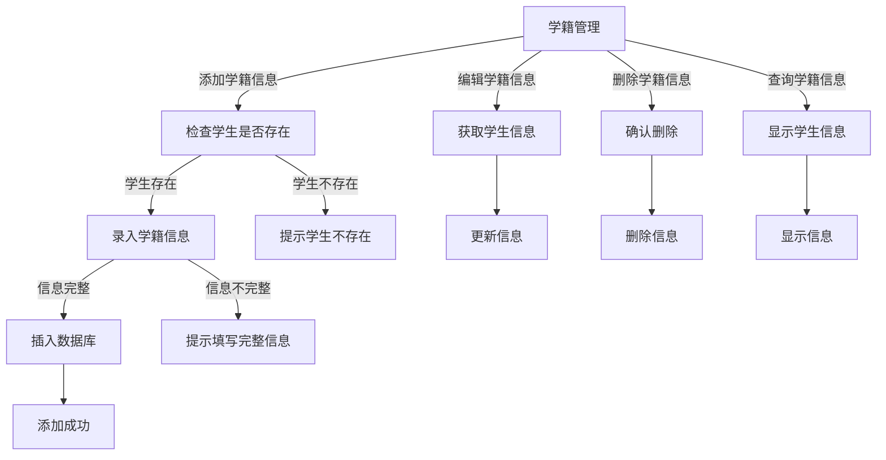
2、班级管理：班级添加、班级修改、班级查询等功能。
```mermaid
graph TD;
    A[班级管理] -->|添加班级| B[录入班级信息]
    A -->|编辑班级| C[获取班级信息]
    A -->|删除班级| D[确认删除]
    A -->|查询班级| E[显示班级信息]

    B -->|信息完整| F[插入班级信息到数据库]
    B -->|信息不完整| G[提示填写完整信息]

    F --> H[添加成功]
    C --> I[更新班级信息]
    D --> J[删除班级信息]
    E --> K[显示班级列表]
 ```   

3、课程管理：包括课程信息（课程号、课程名称和授课老师）的添加和删除。
```mermaid
graph TD;
    A[课程管理] -->|添加课程| B[录入课程信息]
    A -->|编辑课程| C[获取课程信息]
    A -->|删除课程| D[确认删除]
    A -->|查询课程| E[显示课程信息]

    B -->|信息完整| F[插入课程信息到数据库]
    B -->|信息不完整| G[提示填写完整信息]

    F --> H[添加成功]
    C --> I[更新课程信息]
    D --> J[删除课程信息]
    E --> K[显示课程列表]


```


4、成绩管理：包括学生成绩管理（课程号、课程名、学号、成绩）的添加、更改、删除和查询（按学号、班级和查询全部）等功能。
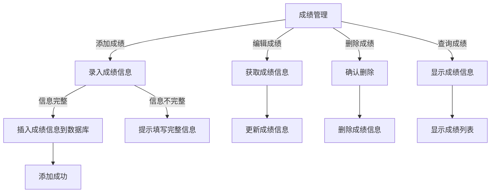

5、打印管理：包括输出学生的成绩单和选课情况等。
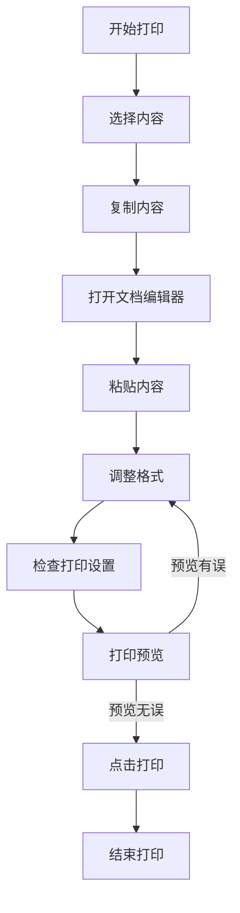

## 四、数据库设计
### 4.1 学生档案表
| 字符名称 | 字符类型 | 字符长度 | 允许空 |
| ------------ | -------- | -------- | ------ | 
| 学号 | varchar | 20 | 否 | 
| 姓名 | varchar | 30 | 否 |
| 性别 | char | 1 | 否 | 
| 专业 | varchar | 50 | 否 | 
| 入学时间 | date | - | 否 |
| 毕业时间 | date | - | 否 |
| 学籍状态 | char | 2 | 否 |
| 家庭住址 | varchar | 50 | 否 |
| 联系方式 | varchar | 20 | 否 |
### 4.2 教师档案表
|字符名称|字符类型|字符长度|允许空|
| --- | --- | --- | --- |
| 教师编号 | varchar | 20 | 否 |
| 姓名 | nvarchar | 50 | 否 | 
| 性别 | char | 1 | 否 | 
| 职务 | nvarchar | 50 | 否 | 
| 电话 | varchar | 11 | 否 |
| 邮箱 | varchar | 20 | 否 |

### 4.3 课程表
|字符名称|字符类型|字符长度|允许空|
| --- | --- | --- | --- |
|课程号|char|20|否 |
|课程名称|nvarchar|50|否 |
|授课老师|char|20| 否|
|学分|decimal(3,1)|-| 否|
|开课时间|date|-| 否|
|课程类型|varchar|20| 否|
|课程描述|nvarchar|100| 是|

### 4.4 管理员表
|字符名称|字符类型|字符长度|允许空|
| --- | --- | --- | --- |
|管理员编号|char|20| 否|
|姓名|nvarchar|20|否 |
|性别|char|1| 否|
|职务|nvarchar|20| 否|
|电话|varchar|11| 否|
|邮箱|varchar|50| 否|

### 4.5 班级表
|字符名称|字符类型|字符长度|允许空|
| --- | --- | --- | --- |
|班级编号|char|20| 否|
|班级名称|nvarchar|20| 否|
|班主任|char|10| 否|
|学院|nvarchar|20|否 |
|专业|nvarchar|20|否 |
|班级人数|int|-| 否|

### 4.6 成绩表
|字符名称|字符类型|字符长度|允许空|
| --- | --- | --- | --- |
|课程号|char|20|否 |
|课程名|nvarchar|50| 否|
|学号|char|20| 否|
|班级|nvarchar|20| 否|
|成绩|decimal(5,2)|-| 否|
|学分|decimal(3,1)|-| 否|
|绩点|decimal(3,2)|-| 否|


## 五、学生信息管理系统原型图
### 5.1 学生信息管理系统登录首页
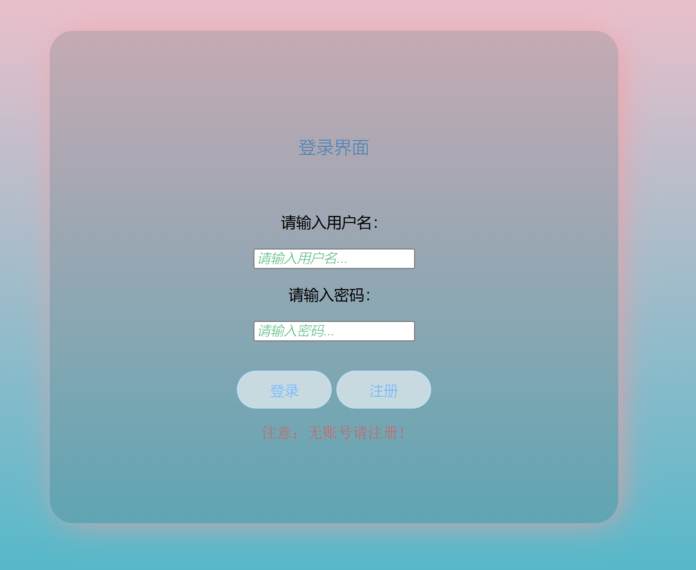
### 5.2 学生信息管理系统学生信息管理模块
图1：学生管理
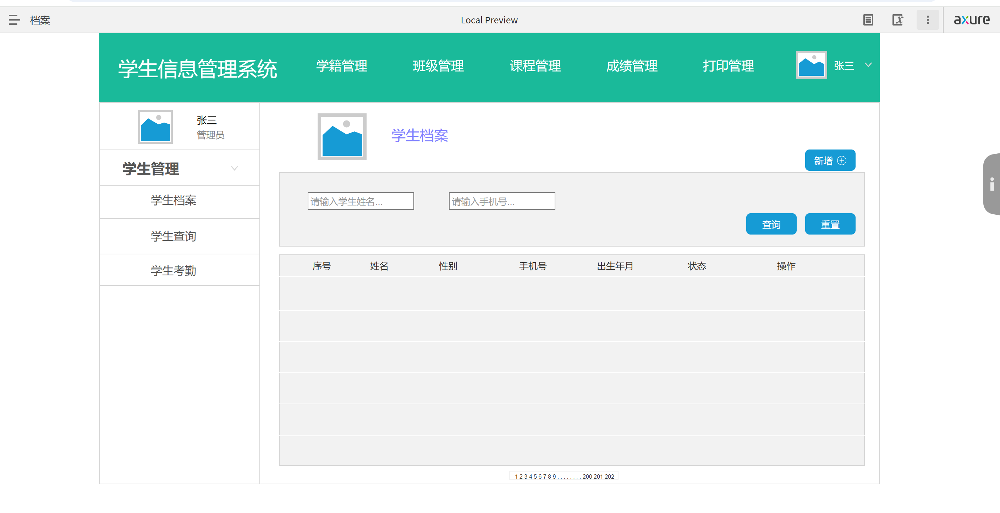
- 学生的初始密码是由管理员指定的。学生登陆后，可以按照要求自行修改使用密码。首先需要输入原始密码，如果原始密码没有输入正确将不能修改密码，只有在原始密码正确的基础上，用户才能继续下面的操作。新密码设定后，系统还要求用户再输入一次重复密码，避免因为误输而导致密码丢失。查询指定学期成绩：学生可以查询自己指定学期的成绩和所有的成绩。方便学生了解自身情况。 选课系统：学生选课系统是针对学生进行网上选课而设计的，学生可以自主选择自己想修的课程。

图2：学生成绩
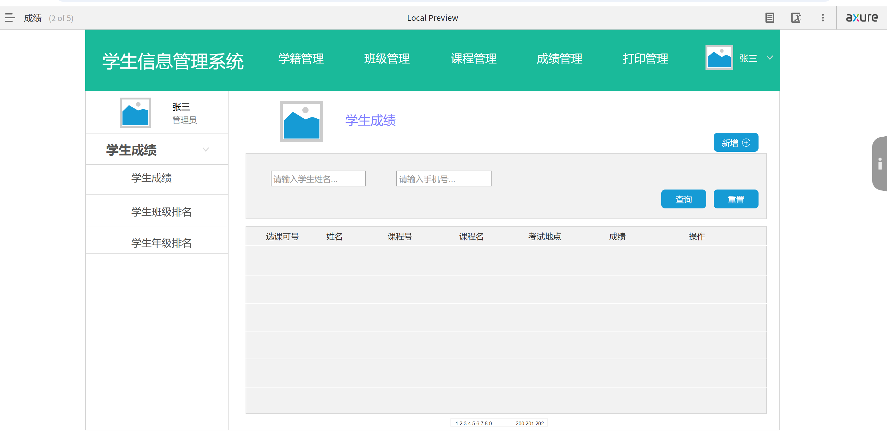
图3：学生班级
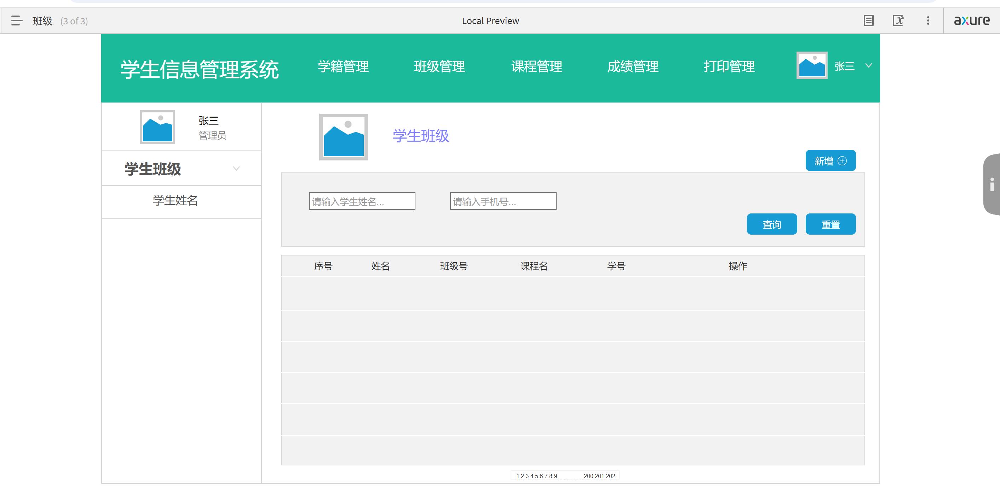
图4：学生课程
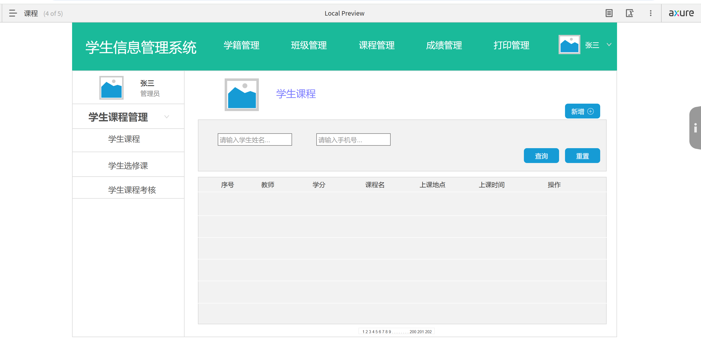
图5：教师用户界面
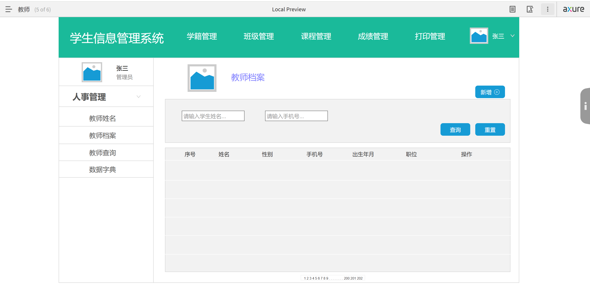
- 查询授课计划：教师可以利用该系统实现查询授课计划的功能，教师不仅可以看到自己本学期要授的课程信息，还能查看选修对应课程的学生名单，同时可以添加对应课程的学生成绩。帮助教师提高了工作效率。    查询学生基本信息：教师可以查询学生的基本信息，以帮助教师了解学生情况。


## 六、接口设计

### 6.1 接口设计目标


#### 6.1.1 用户登录接口
- 接口名称：login
- 请求方式：POST
- 请求参数：
- username（字符串，必填，用户账号）
- password（字符串，必填，用户密码）
- 响应参数：
- status（整数，成功为200，失败为其他错误码）
- message（字符串，成功为“登录成功”，失败为具体错误提示）
- token（字符串，登录成功后生成的身份令牌，用于后续请求验证）

#### 6.1.2 获取学生信息接口
- 接口名称：getStudentInfo
- 请求方式：GET
- 请求参数：
- studentId（整数，选填，按学生ID查询；若不填则查询所有学生信息）
- token（字符串，必填，登录接口返回的身份令牌）
- 响应参数：
- status（整数，成功为200，失败为其他错误码）
- message（字符串，成功为“查询成功”，失败为具体错误提示）
- data（数组或对象，成功时为学生信息数据，数组形式为多条学生信息，对象形式为单条学生信息）

#### 6.1.3 添加学生信息接口
- 接口名称：addStudentInfo
- 请求方式：POST
- 请求参数：
- studentName（字符串，必填，学生姓名）
- studentAge（整数，必填，学生年龄）
- studentGender（字符串，必填，学生性别）
- otherInfo（对象，选填，其他学生相关信息如班级、成绩等）
- token（字符串，必填，登录接口返回的身份令牌）
- 响应参数：
- status（整数，成功为200，失败为其他错误码）
- message（字符串，成功为“添加成功”，失败为具体错误提示）

#### 6.1.4 修改学生信息接口
- 接口名称：updateStudentInfo
- 请求方式：POST
- 请求参数：
- studentId（整数，必填，要修改的学生ID）
- studentName（字符串，选填，修改后的学生姓名）
- studentAge（整数，选填，修改后的学生年龄）
- studentGender（字符串，选填，修改后的学生性别）
- otherInfo（对象，选填，修改后的其他学生相关信息）
- token（字符串，必填，登录接口返回的身份令牌）
- 响应参数：
- status（整数，成功为200，失败为其他错误码）
- message（字符串，成功为“修改成功”，失败为具体错误提示）

#### 6.1.5 删除学生信息接口
- 接口名称：deleteStudentInfo
- 请求方式：POST
- 请求参数：
- studentId（整数，必填，要删除的学生ID）
- token（字符串，必填，登录接口返回的身份令牌）
- 响应参数：
- status（整数，成功为200，失败为其他错误码）
- message（字符串，成功为“删除成功”，失败为具体错误提示）


### 6.2 外部接口

#### 6.2.1 用户接口

##### 6.2.1.1 登录接口：
   <p>        接收用户名和密码信息，验证用户身份，返回登录成功或失败的结果。支持多种登录方式，如普通账号密码登录、单点登录（与学校统一认证平台对接）。</p>

- 接口名称：loginUser
- 请求方式：POST
- 请求参数：
  - username（字符串，必填，要登录的用户名）
  - password（字符串，必填，用户的登录密码）
- 响应参数：
  - status（整数，成功为200，失败为其他错误码）
  - token（字符串，成功时返回的身份令牌，用于后续请求）
  - message（字符串，成功为“登录成功”，失败为具体错误提示）

##### 6.2.1.2 显示接口：
   <p>        根据用户角色（管理员、教师、学生）呈现不同的操作界面和信息展示格式。例如，管理员看到完整的学生信息管理界面，教师看到所授课班级学生信息相关操作界面，学生仅看到自己的信息和相关通知等界面。</p>

- 接口名称：getStudentInfo
- 请求方式：GET
- 请求参数：
  - studentId（整数，必填，要查询的学生ID）
  - token（字符串，必填，登录接口返回的身份令牌）
- 响应参数：
  - status（整数，成功为200，失败为其他错误码）
  - data（对象，成功时返回的学生信息，包括以下字段）
    - id（整数，学生ID）
    - name（字符串，学生姓名）
    - age（整数，学生年龄）
    - class（字符串，学生班级）
  - message（字符串，成功为“获取成功”，失败为具体错误提示）


#### 6.2.2 数据库接口

##### 6.2.2.1. 连接接口：
   <p>        根据用户输入的数据库信息，建立与数据库的稳定连接，配置连接参数，如数据库服务器地址、端口、用户名、密码等。支持不同类型数据库（如 MySQL、SQL Server、Oracle）的切换。</p>

- 接口名称：connectToService
- 请求方式：POST
- 请求参数：
  - serviceName（字符串，必填，要连接的服务名称）
  - userId（整数，必填，用户ID，用于身份验证）
  - token（字符串，必填，登录接口返回的身份令牌）
 - 响应参数：
  - status（整数，成功为200，失败为其他错误码）
  - connectionId（字符串，成功时返回的连接ID，用于后续操作）
  - message（字符串，成功为“连接成功”，失败为具体错误提示）


##### 6.2.2.2.数据操作接口：
<p>         包括对学生基本信息（如姓名、学号、性别、出生日期等）、成绩信息、课程信息、考勤信息等的增删改查  操作。例如，插入新学生信息、更新学生成绩、删除已毕业学生记录等。</p>

- 接口名称：manageStudentData
- 请求方式：POST
- 请求参数：
  - action（字符串，必填，操作类型，包括“add”（添加）、“delete”（删除）、“update”（更新）、“fetch”（查询））
  - studentData（对象，可选，包含学生信息的对象，结构依据操作类型而定）
    - 对于“add”操作：
      -id（整数，必填，学生ID）
      - name（字符串，必填，学生姓名）
      - age（整数，必填，学生年龄）
      - class（字符串，必填，学生班级）
    - 对于“delete”操作：
      - id（整数，必填，要删除的学生ID）
    - 对于“update”操作：
      - id（整数，必填，学生ID）
      - name（字符串，选填，更新后的学生姓名）
      - age（整数，选填，更新后的学生年龄）
      - class（字符串，选填，更新后的学生班级）
    - 对于“fetch”操作：
      - id（整数，选填，要查询的学生ID，如果不填则返回所有学生信息）
  - token（字符串，必填，登录接口返回的身份令牌）
- 响应参数：
  - status（整数，成功为200，失败为其他错误码）
  - data（对象，成功时返回的操作结果数据，结构依据操作类型而定）
    - 对于“add”操作：
      - message（字符串，成功为“添加成功”）
    - 对于“delete”操作：
      - message（字符串，成功为“删除成功”）
    - 对于“update”操作：
      - message（字符串，成功为“更新成功”）
    - 对于“fetch”操作：
      - students（数组，包含查询到的学生信息）
  - message（字符串，成功为“操作成功”，失败为具体错误提示）


##### 6.2.2.3. 数据查询接口：
   <p>         包括对学生基本信息（如姓名、学号、性别、出生日期等）、成绩信息、课程信息、考勤信息等的查询操作。例如，按学号、姓名、班级、课程号等条件查询学生信息、按学号、课程号、班级等条件查询成绩信息等。</p>

- 接口名称：manageStudentData
- 请求方式：POST
- 请求参数：
  - action（字符串，必填，操作类型，包括“add”（添加）、“delete”（删除）、“update”（更新）、“fetch”（查询））
  - studentData（对象，可选，包含学生信息的对象，结构依据操作类型而定）
    - 对于“add”操作：
      - id（整数，必填，学生ID）
      - name（字符串，必填，学生姓名）
      - age（整数，必填，学生年龄）
      - class（字符串，必填，学生班级）
    - 对于“delete”操作：
      - id（整数，必填，要删除的学生ID）
    - 对于“update”操作：
      - id（整数，必填，学生ID）
      - name（字符串，选填，更新后的学生姓名）
      - age（整数，选填，更新后的学生年龄）
      - class（字符串，选填，更新后的学生班级）
    - 对于“fetch”操作：
      - id（整数，选填，要查询的学生ID，如果不填则返回所有学生信息）
  - token（字符串，必填，登录接口返回的身份令牌）
  -响应参数：
  - status（整数，成功为200，失败为其他错误码）
  - data（对象，成功时返回的操作结果数据，结构依据操作类型而定）
    - 对于“add”操作：
      - message（字符串，成功为“添加成功”）
    - 对于“delete”操作：
      - message（字符串，成功为“删除成功”）
    - 对于“update”操作：
      - message（字符串，成功为“更新成功”）
    - 对于“fetch”操作：
      - students（数组，包含查询到的学生信息）
  - message（字符串，成功为“操作成功”，失败为具体错误提示）


### 6.3 内部接口

####  6.3.1 模块间接口


##### 6.3.1.1. 信息查询接口：
   <p>         在学生信息查询模块与数据库访问模块之间，传递查询条件（如按学号、姓名模糊查询等），接收查询结果并返回给查询界面显示。</p>

- 接口名称：getStudentDetails
- 请求方式：GET
- 请求参数：
  - studentId（整数，必填，要查询的学生ID）
  - includeGrades（布尔值，选填，是否包含成绩信息，默认为false）
  - token（字符串，必填，登录接口返回的身份令牌）
- 响应参数：
  - status（整数，成功为200，失败为其他错误码）
  - data（对象，成功时返回的学生信息及相应的成绩，包括以下字段）
    - id（整数，学生ID）
    - name（字符串，学生姓名）
    - age（整数，学生年龄）
    - class（字符串，学生班级）
    - grades（数组，选填，包含学生成绩的数组，只有当includeGrades为true时返回，包含以下字段）
      - subject（字符串，科目名称）
      - score（浮点数，成绩分数）
  - message（字符串，成功为“查询成功”，失败为具体错误提示）


##### 6.3.1.2. 信息更新接口：
<p>         当学生信息更新模块触发更新操作时，将更新的数据内容（如修改后的学生联系方式）传递给数据库更新模块进行处理，同时接收更新成功或失败的反馈。</p>

- 接口名称：updateStudentDetails
- 请求方式：POST
- 请求参数：
  - studentId（整数，必填，要更新的学生ID）
  - contactInfo（字符串，选填，学生联系方式）
  - token（字符串，必填，登录接口返回的身份令牌）

##### 6.3.1.3. 信息传递接口：
4. <p>         在信息传递模块中，将学生信息（如学生基本信息、课程信息、成绩信息等）传递给其他模块进行处理。</p>

- 接口名称：passStudentDetails
- 请求方式：POST
- 请求参数：
  - studentId（整数，必填，要传递的学生ID）
  - studentInfo（对象，必填，包含学生信息的对象，结构依据传递内容而定）
  - token（字符串，必填，登录接口返回的身份令牌）
- 响应参数：
  - status（整数，成功为200，失败为其他错误码）
  - message（字符串，成功为“传递成功”，失败为具体错误提示）

##### 6.3.1.4 信息存储接口：
<p>         在信息存储模块中，将学生信息（如学生基本信息、课程信息、成绩信息等）存储到数据库中。</p>

- 接口名称：storeStudentDetails
- 请求方式：POST
- 请求参数：
  - studentId（整数，必填，要存储的学生ID）
  - studentInfo（对象，必填，包含学生信息的对象，结构依据存储内容而定）
  - token（字符串，必填，登录接口返回的身份令牌）
- 响应参数：
  - status（整数，成功为200，失败为其他错误码）
  - message（字符串，成功为“存储成功”，失败为具体错误提示）

#### 6.3.2 业务逻辑接口

##### 6.3.2.1. 成绩计算接口：
<p>         在成绩管理模块中，接收学生的课程成绩原始数据，根据设定的成绩计算规则（如平时成绩占比、考试成绩占比等）计算总成绩，将结果返回给成绩存储模块。</p>

- 接口名称：calculateGrade
- 请求方式：POST
- 请求参数：
  - studentId（整数，必填，要计算的学生ID）
  - courseGrades（数组，必填，包含课程成绩的数组，包含以下字段）
    - subject（字符串，科目名称）
    - score（浮点数，成绩分数）
  - token（字符串，必填，登录接口返回的身份令牌）
- 响应参数：
  - status（整数，成功为200，失败为其他错误码）
  - grade（浮点数，成功时返回的总成绩）
  - message（字符串，成功为“计算成功”，失败为具体错误提示）

##### 6.3.2.2. 选课接口：
<p>         在学生选课模块中，接收学生的选课请求，根据学生的专业、学分、课程类型、授课老师等条件筛选课程，返回符合条件的课程列表给学生。</p>

- 接口名称：selectCourse
- 请求方式：POST
- 请求参数：
  - studentId（整数，必填，要选课的学生ID）
  - major（字符串，选填，学生专业）
  - credits（整数，选填，学生学分）
  - courseType（字符串，选填，课程类型）
  - teacher（字符串，选填，授课老师）
  - token（字符串，必填，登录接口返回的身份令牌）
- 响应参数：
  - status（整数，成功为200，失败为其他错误码）
  - courses（数组，成功时返回的课程列表，包含以下字段）
    - id（整数，课程ID）
    - name（字符串，课程名称）
    - credit（整数，课程学分）
    - teacher（字符串，授课老师）
  - message（字符串，成功为“选课成功”，失败为具体错误提示）

##### 6.3.2.3. 考勤统计接口：
<p>         从考勤记录模块获取学生的考勤数据，按照一定的统计周期（如每周、每月）统计考勤情况（出勤次数、缺勤次数、迟到次数等），为后续的考勤分析和处理提供数据支持。</p>

- 接口名称：countAttendance
- 请求方式：POST
- 请求参数：
  - studentId（整数，必填，要统计的学生ID）
  - startDate（日期，选填，统计开始日期）
  - endDate（日期，选填，统计结束日期）   
  - token（字符串，必填，登录接口返回的身份令牌）
- 响应参数：
  - status（整数，成功为200，失败为其他错误码）
  - attendances（对象，成功时返回的考勤统计结果，包含以下字段）
    - totalDays（整数，统计期间总天数）
    - presentDays（整数，出勤天数）
    - lateDays（整数，迟到天数）
    - absentDays（整数，缺勤天数）
    - lateTimes（整数，迟到次数）
    - absentTimes（整数，缺勤次数）
  - message（字符串，成功为“统计成功”，失败为具体错误提示）


##### 6.3.2.4. 选课接口：
<p>         在学生选课模块中，接收学生的选课请求，根据学生的专业、学分、课程类型、授课老师等条件筛选课程，返回符合条件的课程列表给学生。</p>

-  接口名称：selectCourse
- 请求方式：POST
- 请求参数：
  - studentId（整数，必填，要选课的学生ID）
  - major（字符串，选填，学生专业）
  - credits（整数，选填，学生学分）
  - courseType（字符串，选填，课程类型）
  - teacher（字符串，选填，授课老师）
  - token（字符串，必填，登录接口返回的身份令牌）
- 响应参数：
  - status（整数，成功为200，失败为其他错误码）
  - courses（数组，成功时返回的课程列表，包含以下字段）
    - id（整数，课程ID）
    - name（字符串，课程名称）
    - credit（整数，课程学分）
    - teacher（字符串，授课老师）
  - message（字符串，成功为“选课成功”，失败为具体错误提示）

##### 6.3.2.5. 班级管理接口：
<p>         在班级管理模块中，接收学生的班级申请，根据学生的专业、学分、课程类型、授课老师等条件筛选班级，返回符合条件的班级列表给学生。</p>

- 接口名称：manageClass
- 请求方式：POST
- 请求参数：
  - studentId（整数，必填，要申请班级的学生ID）
  - major（字符串，选填，学生专业）
  - credits（整数，选填，学生学分）
  - courseType（字符串，选填，课程类型）
  - teacher（字符串，选填，授课老师）
  - token（字符串，必填，登录接口返回的身份令牌）
- 响应参数：
  - status（整数，成功为200，失败为其他错误码）
  - classes（数组，成功时返回的班级列表，包含以下字段）
    - id（整数，班级ID）
    - name（字符串，班级名称）
    - teacher（字符串，班主任）
    - students（数组，班级成员列表）
  - message（字符串，成功为“申请成功”，失败为具体错误提示）

##### 6.3.2.6. 打印接口：
<p>         在打印管理模块中，接收学生的成绩单或选课情况打印请求，根据学生的学号、班级、课程号等条件筛选数据，生成相应的打印输出。</p>

- 接口名称：printDocument
- 请求方式：POST
- 请求参数：
  - studentId（整数，必填，要打印的学生ID）
  - classId（整数，选填，学生所在班级ID）
  - courseId（整数，选填，课程ID）
  - token（字符串，必填，登录接口返回的身份令牌）
- 响应参数：
  - status（整数，成功为200，失败为其他错误码）
  - document（字符串，成功时返回的打印输出）
  - message（字符串，成功为“打印成功”，失败为具体错误提示） 

## 七、系统测试

1. 功能测试：对每个功能模块进行详细测试，确保各项功能符合预期。
2. 性能测试：模拟大量数据和并发操作，测试系统的响应速度和稳定性。
3. 安全测试：检查系统的用户认证、授权和数据加密等安全机制。

## 八、总结

学生信息管理系统通过合理的设计和实现，能够满足学校对学生信息管理的需求，提高管理效率和服务质量，为学校的信息化建设提供有力支持。同时，可根据实际使用情况不断优化和完善系统功能。


