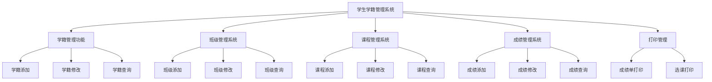
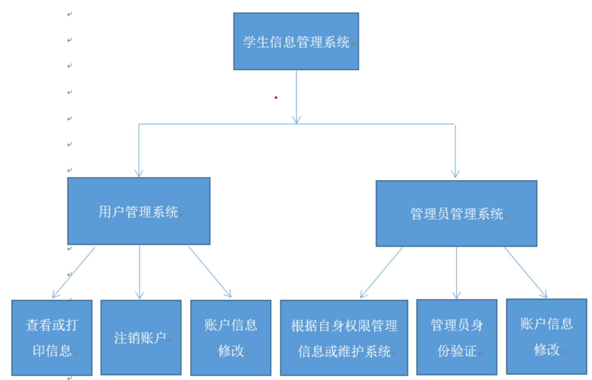
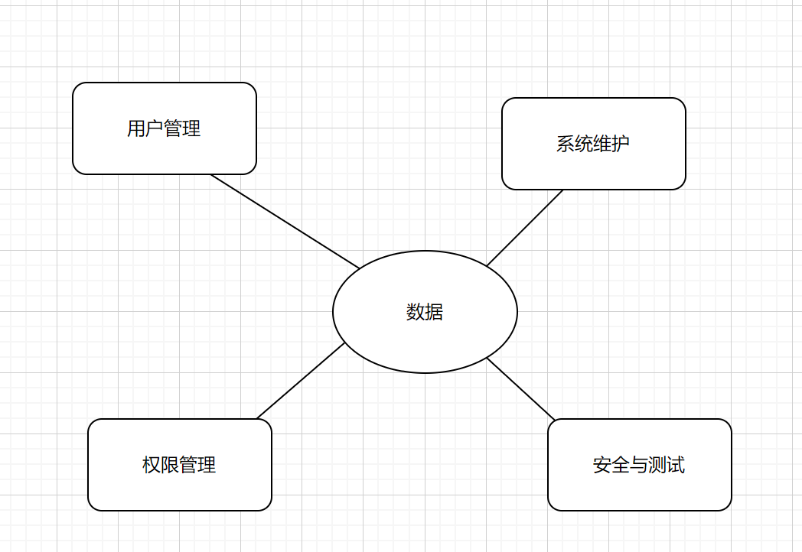
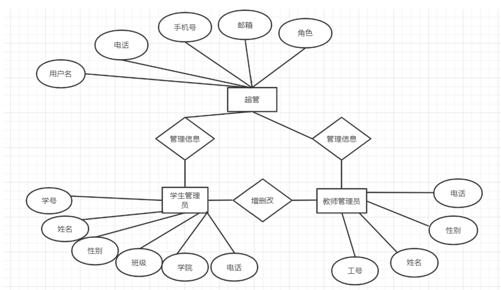
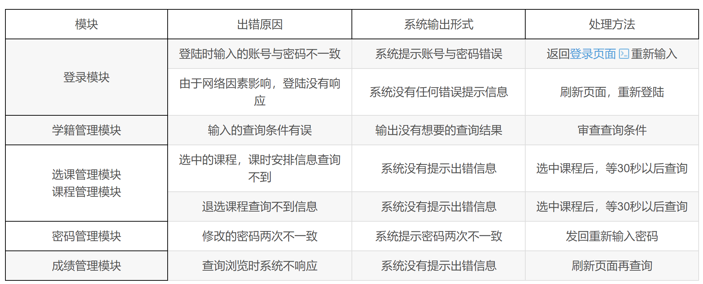

# 
<fond face="宋体" >“学生信息管理系统” - 概要设计 </fond>

## 一、引言
### 1.1 编写目的

      由于现在的学校规模在逐渐的扩大，设置的专业类别、分支机构及老师、学生人数越来越多，对于过去的学生信息管理系统，
不能满足当前学生信息管理的服务性能要求。本报告对于开发新的学生信息管理系统面临的
问题及解决方案进行初步的设计与合理的安排对用户需求进行了全面细致的分析，更清晰的理解学生信息管理系统功能需求，
深入描述软件的功能和性能与界面，确定该软件设计的限制和定义软件的其他有效性需求，
对开发计划进行了总体的规划确定开发的需求与面临困难的可行性分析。

### 1.2 编写背景
- 待开发的软件系统名称：学生信息管理系统
- 改善学校教学、科研、管理等各个方面的工作流程
- 方便学生、教师、院系、学校管理人员管理学生信息
- 降低信息管理成本，提高工作效率
- 用户：学生、教师、院系、学校管理人员
  
### 1.3 术语定义
SIMS: Student Information Management System 学生信息管理系统

SQL: Structured Query Language 关系数据库标准语言

### 1.4 参考资料
[1]《软件工程-软件建模与文档写作》[M] 人民邮电出版社[^1]
[2]《数据库原理》[M] 经济科学出版社[^2]
[3]《数据库系统原理》[M] 清华大学出版社[^3]

## 二、详细设计基本内容

### 2.1 处理方式的设计
- 数据结构设计：对需求分析、总体设计确定的概念性数据类型进行确切的定义。例如，学生信息表、课程信息表、成绩信息表等。
- 算法设计：用某种图形、表格、语言等工具将每个模块处理过程的详细算法描述出来，并为实现软件系统的功能需求确定所必需的算法，评估算法的性能。
- 性能设计：为满足软件系统的性能需求确定所必需的算法和模块间的控制方式。
- 确定外部信号的接受发送形式：定义系统与其他系统或用户交互时，外部信号的接收和发送方式。
- 物理设计:对数据库进行物理设计，确定数据库的物理结构，包括表结构、索引、存储过程等。
- 可靠性设计:设计系统的错误处理机制、数据备份与恢复策略，确保系统的稳定运行和数据安全。
- 代码设计：为了提高数据的输入、分类、存储及检索等操作的效率，以及节约内存空间，对数据库中的某些数据项的值进行代码设计。
- 输入输出格式设计：针对各个功能，根据界面设计风格，设计各类界面的样式，确保用户界面的友好性和易用性。

### 2.2 主要软件功能需求模板

- 学生信息录入
由负责录入学生身份信息的管理员、负责录入学生成绩信息的管理员、负责录入学生荣誉信息的管理员分别录入学生的各项信息，他们的录入是互相独立的，具有同一等级的权限，在此之上，设立可以录入所有类别学生信息的超级管理员，具有更高一级的权限。

- 学生信息查看
所有用户都可以使用学生信息查看功能，但学生只可查看自己的信息，而管理员可以查看所有学生的信息。信息具体有学生的身份信息，如姓名、学号、年级、身份证号、通讯地址等，成绩，获得过的荣誉等

- 学生信息修改
只有管理员可以使用学生信息筛查功能，管理员可以通过学生姓名或学生的其他信息来筛查学生。例如管理员可以通过输入学生的姓名或学号查找某一个学生，也可以通过筛选列出所有获得过某奖项的学生

- 学生信息打印
所有用户都可以使用学生信息打印功能，学生可以打印自己的信息，管理员可以打印某个学生的信息，也可以打印筛查出来的学生列表。

- 用户管理
共包括4个功能模块：对账户的注册和<注销、登录和退出、管理员身份验证、密码修改。

#### 2.2.1 学生信息管理系统功能表

|功能名称|功能详情|
|:--|:--|
|用户认证|支持教师、管理员登录，验证账号密码|
|学生信息录入|输入学生基本信息（姓名、学号、性别、出生日期等）和扩展信息（家庭住址、家长联系方式等）|
|信息查询|按学号、姓名、班级等快速查找学生信息，支持多条件组合查询|
|信息修改|修改学生的各项信息，并记录修改日志|
|信息删除|删除指定学生信息，有确认提示|
|班级管理|创建、编辑、删除班级信息，关联班级内学生|
|课程管理|添加、修改、删除课程信息，设置课程学分|
|成绩管理|录入、修改、查询学生课程成绩，计算总分、平均分等|
|报表生成|生成学生信息报表、成绩报表等，可导出为PDF、Excel格式|

### 2.3 限制和约束

       本软件在开发的过程中，分为技术实现与软件工程两大部分，两部分都有侧重点，若技术支持出现故障或疑难问题无法解决、程序开发出现偏差，会延误工程进度，影响工程的按期完工。若软件工程陈述出现问题，部分描述含混不清，则会影响系统的完整性与可继承性。在管理方面，如管理者没有预见性，对出向的问题无法采用可行的解决手段，都会影响开发模块之间的互动，从而影响工程的顺利开展，导致工程无法按期完工。

### 2.4 系统功能模块设计
#### 2.4.1 结构设计

#### 2.4.2 功能模块设计
==(1)功能模块==
• 学生信息录入模块：用于输入新学生的基本资料，包括姓名、学号、性别、年龄、班级等，学号需唯一。可通过表单形式实现，输入后数据存储至数据库。

• 信息查询模块：能依据学号、姓名、班级等关键信息查找学生，查询结果以列表形式呈现，方便查看学生详情。

• 信息修改模块：当学生信息有变动时，通过学号等标识找到学生记录并修改，同时更新数据库。

• 信息删除模块：对于退学等情况，可根据条件删除相应学生信息，删除操作要谨慎并可进行提示确认。

==(2)数据库设计==

• 学生表：包含学号、姓名、性别、年龄、班级等字段，学号设为主键。根据需要可添加其他字段，如家庭住址、联系方式等。

==(3)界面设计==

• 主界面：有清晰的功能菜单，如“录入”“查询”“修改”“删除”等按钮，界面简洁，方便操作。可使用图形化界面提高易用性。

==(4)系统流程设计==

• 系统启动后进入主界面，用户根据需求选择功能，操作完成后可返回主界面或退出系统。每个功能模块执行相应的数据库操作流程，保证数据的准确性和完整性。

### 2.5 运行环境设计
#### 2.5.1 硬件环境
- 服务器端：处理器建议使用Intel酷睿i5及以上，内存8GB以上，硬盘存储容量500GB以上，以满足大量数据存储和处理需求。客户端：普通PC机，处理器Intel酷睿i3及以上，内存4GB以上，硬盘128GB以上。
  
#### 2.5.2 软件环境
- 服务器端：操作系统采用Windows Server 2019或Linux（如Ubuntu 20.04等），数据库管理系统使用MySQL 8.0，Web服务器可选择Tomcat 9.0。客户端：Windows 10或以上版本操作系统，浏览器使用Chrome、Firefox等主流浏览器。

### 2.6 功能需求与程序关系表
|功能需求|程序模块|程序功能描述|
|:--:|:--:|:--:|
|用户登录|登录模块|验证用户名和密码，创建用户会话|
|学生信息录入|信息添加模块|接收输入的学生信息并存储到数据库|
|学生信息查询|信息查询模块|根据关键词、条件从数据库检索并显示学生信息|
|学生信息修改|信息修改模块|获取要修改的学生信息，更新数据库中的对应内容|
|学生信息删除|信息删除模块|依据指定条件删除数据库中的学生信息记录|
|数据备份|备份模块|将数据库中的学生信息备份到指定存储位置|
|数据恢复|恢复模块|从备份文件恢复学生信息到数据库|
|生成报表|报表模块|整合学生信息，生成如成绩报表、信息汇总报表等，并提供下载|

### 2.7 设计原则和总体设计
- 实用性原则
学生信息管理系统大大改善了学校教学、科研与管理的基础环境，在一定程度上反映出学校管理现代化的水平。信息管理系统提供了强大的学生档案管理功能，方便管理员对学生信息的添加、修改、删除、查询等操作。本系统开发可实现学生信息管理的系统化、规范化、自动化、以达到提高学生信息管理效率的目的。

- 可扩展性原则与可维护性原则
数据库的维护，有效地利用数据是网站维护的重要内容，因此数据库的维护要受到重视；信息的更新、调整等；制定出相关的学生信息管理系统维护的规定以便将学生信息管理系统制度化、规范化。

- 安全可靠性原则
系统环境要保证独立安全，防止外来无关人员窃取信息。各用户要分清权限，学生用户仅能查询、增添自己的相关信息，学号、学龄等。敏感信息仅能通过高级管理员修改。管理员增添信息需要严格依据学校提供的信息，修改信息需要向学生确认新信息正确性。学生信息管理系统仅在学校内部使用，需要防止无关人员进入系统。

- 用户界面设计原则
为了使用户（学生）和系统管理人员，管理者（教师）使用此系统的时候更加快捷方便。系统功能设置就不需要十分繁琐，只要有较好用户图形设计界面使用起来方便快捷即可。

- 数据库设计原则
系统使用最频繁的还是查询功能所以查询界面要简洁、明了，而且查询信息的速度至关重要，直接影响到用户的使用体验，所以Mysql数据库的设计是否合理，将直接影响到系统的性能。

## 三、设计软件结构

### 3.1 层次图

### 3.2 软件体系结构

### 3.3 功能需求追溯
- 从需求回溯项目目标
        从需求回溯相应的项目目标，确认学生管理系统需求的源头。满足各项当初的既定目标，包括功能等其他要求。
- 从需求回溯产品
        由于开发过程中系统需求转变为软件需求、设计、代码等，所以通过定义单个需求和特定的产品元素之间的联系链可从需求向前追溯。这种联系链可以使得需求对应的学生管理系统产品部件，从而确保产品部件满足每个需求。

## 四、接口设计

### 4.1 用户登录接口
• 接口名称：login
• 请求方式：POST
• 请求参数：
• username（字符串，必填，用户账号）
• password（字符串，必填，用户密码）
• 响应参数：
• status（整数，成功为200，失败为其他错误码）
• message（字符串，成功为“登录成功”，失败为具体错误提示）
• token（字符串，登录成功后生成的身份令牌，用于后续请求验证）

### 4.2 获取学生信息接口
• 接口名称：getStudentInfo
• 请求方式：GET
• 请求参数：
• studentId（整数，选填，按学生ID查询；若不填则查询所有学生信息）
• token（字符串，必填，登录接口返回的身份令牌）
• 响应参数：
• status（整数，成功为200，失败为其他错误码）
• message（字符串，成功为“查询成功”，失败为具体错误提示）
• data（数组或对象，成功时为学生信息数据，数组形式为多条学生信息，对象形式为单条学生信息）

### 4.3 添加学生信息接口
• 接口名称：addStudentInfo
• 请求方式：POST
• 请求参数：
• studentName（字符串，必填，学生姓名）
• studentAge（整数，必填，学生年龄）
• studentGender（字符串，必填，学生性别）
• otherInfo（对象，选填，其他学生相关信息如班级、成绩等）
• token（字符串，必填，登录接口返回的身份令牌）
• 响应参数：
• status（整数，成功为200，失败为其他错误码）
• message（字符串，成功为“添加成功”，失败为具体错误提示）

### 4.4 修改学生信息接口
• 接口名称：updateStudentInfo
• 请求方式：POST
• 请求参数：
• studentId（整数，必填，要修改的学生ID）
• studentName（字符串，选填，修改后的学生姓名）
• studentAge（整数，选填，修改后的学生年龄）
• studentGender（字符串，选填，修改后的学生性别）
• otherInfo（对象，选填，修改后的其他学生相关信息）
• token（字符串，必填，登录接口返回的身份令牌）
• 响应参数：
• status（整数，成功为200，失败为其他错误码）
• message（字符串，成功为“修改成功”，失败为具体错误提示）

### 4.5 删除学生信息接口
• 接口名称：deleteStudentInfo
• 请求方式：POST
• 请求参数：
• studentId（整数，必填，要删除的学生ID）
• token（字符串，必填，登录接口返回的身份令牌）
• 响应参数：
• status（整数，成功为200，失败为其他错误码）
• message（字符串，成功为“删除成功”，失败为具体错误提示）

## 五、数据库构建

### 5.1 数据库逻辑设计

### 5.2 该系统使用数据库对数据进行管理，使用的数据库如下：
1.学生档案表
|字符名称|字符类型|字符长度|主键|允许空|
| --- | --- | --- | --- | ---|
|学号|varchar|20|√|否|
|姓名|varchar|20| |否|
|性别|varchar|10||否 |
|专业|varchar|20| |否|
|入学时间|varchar|20||否 |
|毕业时间|varchar|20||否 |
|学籍状态|varchar|20| |否|
|家庭住址|varchar|50| |否|
|联系方式|varchar|20||否 |

2.教师档案表
|字符名称|字符类型|字符长度|主键|允许空|
| --- | --- | --- | --- |---|
|教师编号|varchar|20|√|否|
|姓名|varchar|20| |否|
|性别|varchar|10| |否|
|职务|varchar|20| |是|
|电话|varchar|20| |否|
|邮箱|varchar|50| |否|

3.课程表
|字符名称|字符类型|字符长度|主键|允许空|
| --- | --- | --- | --- |---|
|课程号|varchar|20|√|否 |
|课程名称|varchar|50||否 |
|授课老师|varchar|20|| 否|
|学分|varchar|10||否|
|开课时间|varchar|20|| 否|
|课程类型|varchar|20| |否|
|课程描述|varchar|100| |是|

4.管理员表
|字符名称|字符类型|字符长度|主键|允许空|
| --- | --- | --- | --- | ---| 
|管理员编号|varchar|20| √|否|
|姓名|varchar|20||否 |
|性别|varchar|10| |否|
|职务|varchar|20| |否|
|电话|varchar|20| |否|
|邮箱|varchar|50| |否|

5.班级表
|字符名称|字符类型|字符长度|主键|允许空|
| --- | --- | --- | --- |---|
|班级编号|varchar|20| √|否|
|班级名称|varchar|20| |否|
|班主任|varchar|20| |否|
|学院|varchar|20||否 |
|专业|varchar|20||否 |
|班级人数|varchar|10|| 否|

6.成绩表
|字符名称|字符类型|字符长度|主键|允许空|
| --- | --- | --- | --- | ---|
|课程号|varchar|20|√|否 |
|课程名|varchar|50| |否|
|学号|varchar|20| |否|
|班级|varchar|20| |否|
|成绩|varchar|10| |否|
|学分|varchar|10| |否|
|绩点|varchar|10| |否|

### 5.3 数据结构与程序的关系表

|功能需求|程序模块|程序功能描述|
|:--:|:--:|:--:|
|用户登录|登录模块|验证用户名和密码，创建用户会话|
|学生信息录入|信息添加模块|接收输入的学生信息并存储到数据库|
|学生信息查询|信息查询模块|根据关键词、条件从数据库检索并显示学生信息|
|学生信息修改|信息修改模块|获取要修改的学生信息，更新数据库中的对应内容|
|学生信息删除|信息删除模块|依据指定条件删除数据库中的学生信息记录|
|数据备份|备份模块|将数据库中的学生信息备份到指定存储位置|
|数据恢复|恢复模块|从备份文件恢复学生信息到数据库|
|生成报表|报表模块|整合学生信息，生成如成绩报表、信息汇总报表等，并提供下载|

## 六、使用的开发技术和应该注意的事项
- 鉴于开发条件有限，Microsoft SQL Server2008数据库设计约束,编程语言限制为Java、时间仓促,会优先保障关键功能的使用再完善其他功能。

- 学生信息管理系统仅在学校内部使用，需要防止无关人员进入系统。

- 本系统的开发完全按照老师和学生的要求设计，包括软件、硬件。

- 为了使新用户和一些特殊用户方便使用，所以界面要简洁、明了，着重运行速度和安全。

## 七、运行设计

       学籍信息管理模块运行时通过与学生信息数据库连接，搜索学生信息，并将结果显示给用户，可以修改学生学籍信息选课管理模块运行时通过与选课信息数据库连接，学生可以选择相应的课程，也可以退选选中的课程。将查询匹配的信息显示给不同身份的用户。

## 八、安全与故障处理设计

## 九、系统维护更新设计

       学生信息管理系统，在整个系统的运行过程中，系统的维护和管理是始终贯穿其中的，包括进行系统应用程序的维护、代码的维护、数据的备份与恢复、硬件设备维护。系统在运行时，也要随着环境的变化根据不同的需求及变化对系统进行必要的修改，使得系统功能更加完善。系统维护工作贯穿于系统的整个运行过程中，包括：系统应用程序的维护、数据的维护、代码的维护、硬件设备维护，系统维护的重点是系统应用软件的维护工作。而系统维护工作不应总是被动的等待用户提出要求后才进行，应进行主动的预防性维护。

[^1]:龙浩 王文乐 刘金 戴莉萍 《软件工程-软件建模与文档写作》[M] 人民邮电出版社
[^2]:丁宝康 《数据库原理》[M] 经济科学出版社
[^3]:王珊 陈红 《数据库系统原理》[M] 清华大学出版社

  

