# 
<fond face="宋体" >“学生信息管理系统”软件需求说明书 </fond>

## 一、项目简介
### 1.1 引言

        随着信息化建设的不断推进，学校的学生信息管理工作越来越繁重，越来越复杂。为了提高学校的管理效率，降低管理成本，减少管理人员的工作量，减少管理成本，学校需要建立一套智能化、信息化的学生信息管理系统。本软件需求分析报告主要阐述了学生信息管理系统的功能需求，以便于开发人员、测试人员、项目经理、文档编写人员、系统维护人员等进行软件设计、开发、测试、文档编写、维护等工作的指导。本文档的编写目的，是为了确定用户对智能化、信息化管理系统的实际需求，基于B/S架构的学校学生信息管理系统，使学校的学生信息管理工作更加高效，安排更加合理，使学校对于学生的信息管理更加清晰明朗。

### 1.2 项目目标

- 实现学生信息的管理，提高学籍信息的精确度。
- 利用计算机程序，减轻管理人员的压力和提升工作效率。
- 实现不同角色的用户需求，角色之间灵活多变。
- 进行学生各种信息的日常管理，实现学生信息的系统化、规范化和自动化。

### 1.3 用户角色
 
本系统的用户角色分为学生端和教师端，具体如下：

 1.学生端
- ==学生端的功能分为登录、注册、查看个人信息、查看成绩、申请修改信息==

2.教师端
- ==教师端的功能分为登录、注册、查看学生信息、修改学生信息、删除学生信息、添加学生信息、查看学生申请的修改信息==
  

## 二、系统概要与系统构成
### 2.1系统化的业务范围

        该系统包括五大模块，分别是成绩管理模块、学籍管理模块、班级管理模块、课程管理模块、打印管理模块，涵盖了学生管理的基本功能，适用于高校和初等中学。

### 2.2系统概念
#### 2.2.1概念定义：
- 需求分析：软件定义时期的最后一个阶段，准确回答“系统必须做什么的问题”。
- DFD图：数据流图（描述逻辑模型的图形工具）。
- E-R图：实体联系图（描述数据模型的图形工具）。
- 类图：显示了模型的静态结构，特别是模型中存在的类、类的内部结构以及它们与其他类的关系等。
- 用例图：是用户与系统交互的最简表示形式，展现了用户和与他相关的用例之间的关系。

#### 2.2.2功能定义：
- 成绩管理：包括学生成绩管理（课程号、课程名、学号、成绩）的添加、更改、删除和查询（按学号、班级和查询全部）等功能。
- 学籍管理：包括学生基本信息管理。其中学生基本信息管理包括学生基本信息（学生编号、姓名、性别、所在专业等）的添加、更改、删除和查询。
- 班级管理：班级添加、班级修改、班级查询等功能。
- 课程管理：包括课程信息（课程号、课程名称和授课老师）的添加和删除。
- 打印管理：包括输出学生的成绩单、学籍证明单和选课情况等的打印。
#### 2.2.3系统构成图
##### 2.2.3.1系统层次结构图

1.模块间调用关系图

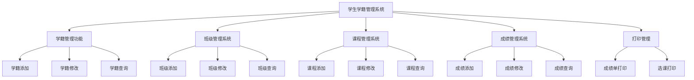

2.基本实体间的E-R图
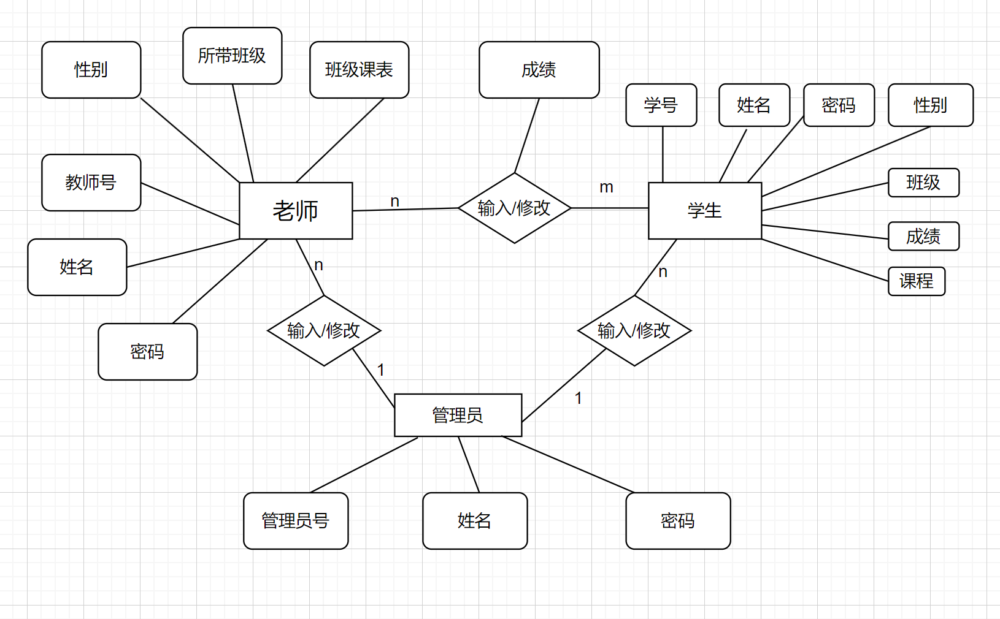

##### 2.2.3.2数据字典
| 项目 | 组成 | 类型 | 来源 | 去向 |存储者 |使用频度|变动频度|
| --- | --- | --- | --- | --- | --- | --- | --- |
| 学生基本信息 | 学生编号、姓名、性别、所在专业、入学时间、毕业时间、学籍状态、家庭住址、联系方式 | 数据存储 | 教务处 | 学生管理系统 | 学生管理系统 | 低 | 低 |
| 课程信息 | 课程号、课程名称、授课老师、学分、开课时间、课程类型、课程描述 | 数据存储 | 教务处 | 学生管理系统 | 学生管理系统 | 低 | 低 |
| 班级信息 | 班级编号、班级名称、班主任、学院、专业、班级人数 | 数据存储 | 教务处 | 学生管理系统 | 学生管理系统 | 低 | 低 |
| 学生成绩信息 | 课程号、课程名、学号、班级、成绩、学分、绩点、 | 数据存储 | 教务处 | 学生管理系统 | 学生管理系统 | 低 | 低 |
| 学生申请修改信息 | 学生编号、申请原因、申请内容、申请时间、审批状态、审批意见、审批时间 | 数据存储 | 学生 | 学生管理系统 | 学生管理系统 | 低 | 低 |
| 学生选课信息 | 学生编号、课程号、选课时间、选课状态 | 数据存储 | 学生 | 学生管理系统 | 学生管理系统 | 低 | 低 |
| 学生打印信息 | 学生编号、打印类型、打印时间、打印状态、打印内容 | 数据存储 | 学生 | 学生管理系统 | 学生管理系统 | 低 | 低 |
| 教师信息 | 教师编号、姓名、性别、职务、电话、邮箱 | 数据存储 | 教务处 | 学生管理系统 | 学生管理系统 | 低 | 低 |
|管理员信息 | 管理员编号、姓名、性别、职务、电话、邮箱| 数据存储 | 教务处 | 学生管理系统 | 学生管理系统 | 低 | 低 |
##### 2.2.2.3数据描述
1.数据库访问权限表
|字符名称|字符类型|字符长度|允许空|
| --- | --- | --- | --- |
|用户名|varchar|20| 否|
|密码|varchar|20| 否|
|权限|varchar|10| 否|
|级别|varchar|10|否 |

2.学生档案表
|字符名称|字符类型|字符长度|允许空|
| --- | --- | --- | --- |
|学号|varchar|20|否|
|姓名|varchar|20| 否|
|性别|varchar|10|否 |
|专业|varchar|20| 否|
|入学时间|varchar|20|否 |
|毕业时间|varchar|20|否 |
|学籍状态|varchar|20| 否|
|家庭住址|varchar|50| 否|
|联系方式|varchar|20|否 |

3.教师档案表
|字符名称|字符类型|字符长度|允许空|
| --- | --- | --- | --- |
|教师编号|varchar|20| 否|
|姓名|varchar|20| 否|
|性别|varchar|10| 否|
|职务|varchar|20| 是|
|电话|varchar|20| 否|
|邮箱|varchar|50| 否|

4.课程表
|字符名称|字符类型|字符长度|允许空|
| --- | --- | --- | --- |
|课程号|varchar|20|否 |
|课程名称|varchar|50|否 |
|授课老师|varchar|20| 否|
|学分|varchar|10| 否|
|开课时间|varchar|20| 否|
|课程类型|varchar|20| 否|
|课程描述|varchar|100| 是|

5.管理员表
|字符名称|字符类型|字符长度|允许空|
| --- | --- | --- | --- |
|管理员编号|varchar|20| 否|
|姓名|varchar|20|否 |
|性别|varchar|10| 否|
|职务|varchar|20| 否|
|电话|varchar|20| 否|
|邮箱|varchar|50| 否|

6.班级表
|字符名称|字符类型|字符长度|允许空|
| --- | --- | --- | --- |
|班级编号|varchar|20| 否|
|班级名称|varchar|20| 否|
|班主任|varchar|20| 否|
|学院|varchar|20|否 |
|专业|varchar|20|否 |
|班级人数|varchar|10| 否|

7.成绩表
|字符名称|字符类型|字符长度|允许空|
| --- | --- | --- | --- |
|课程号|varchar|20|否 |
|课程名|varchar|50| 否|
|学号|varchar|20| 否|
|班级|varchar|20| 否|
|成绩|varchar|10| 否|
|学分|varchar|10| 否|
|绩点|varchar|10| 否|

## 三、结构化分析
### 3.1整体的业务流程

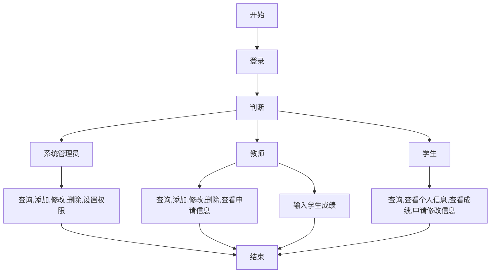
### 3.2系统基本数据框架
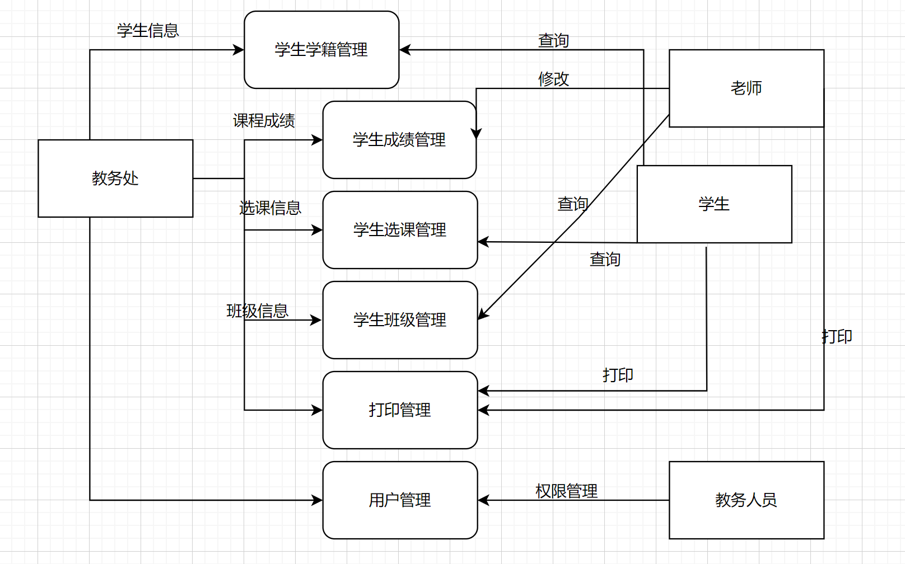

### 3.3成绩业务的业务流程
#### 3.3.1.学生成绩管理流程图
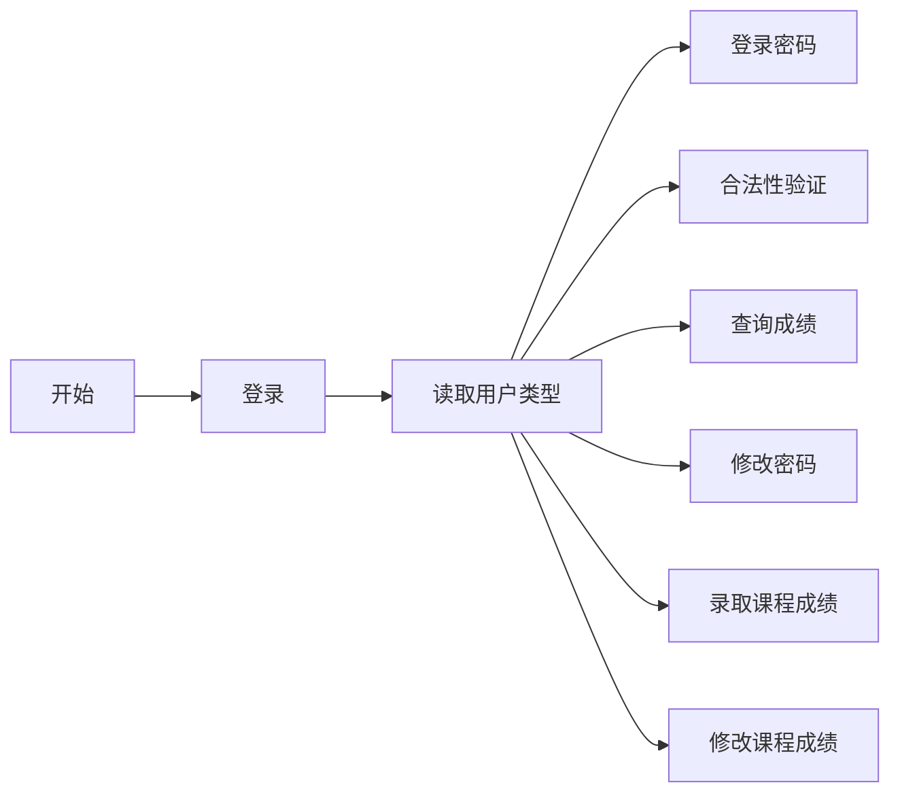

#### 3.3.2. 顶层数据流图   
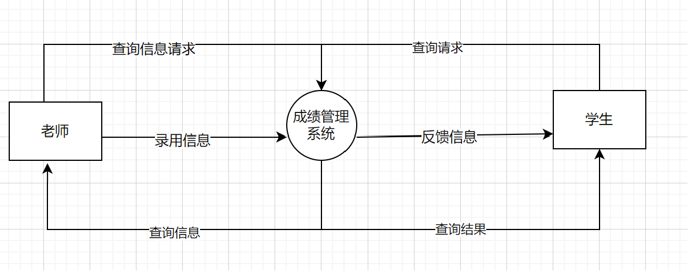

#### 3.3.3. 0层数据流图
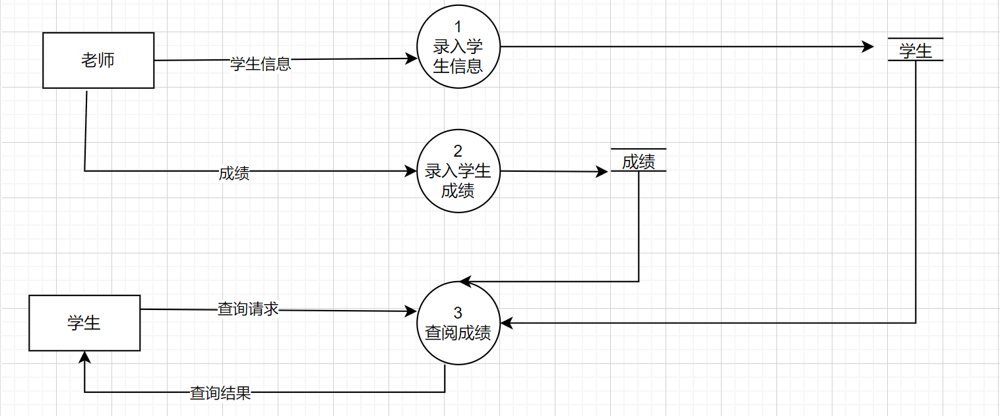

#### 3.3.4. 1层数据流图
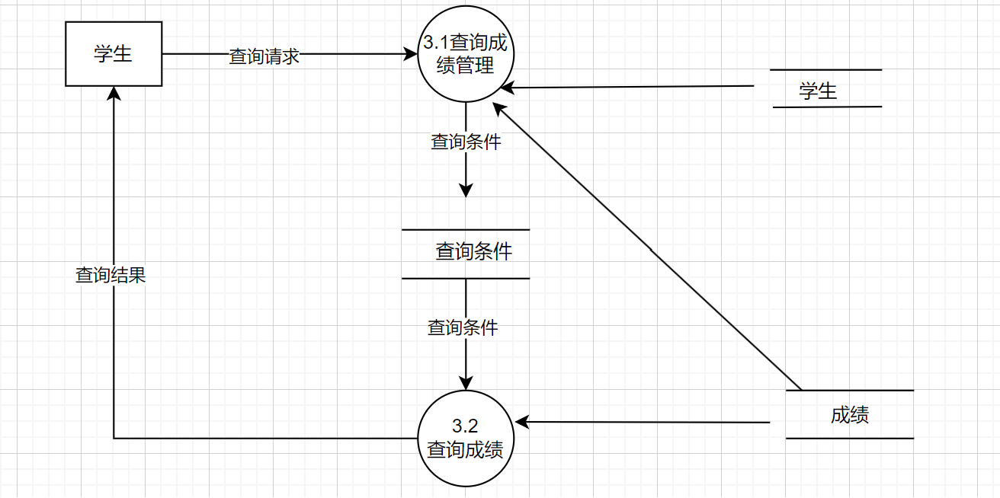

### 3.4 课程管理的业务流程
#### 3.4.1. 顶层图
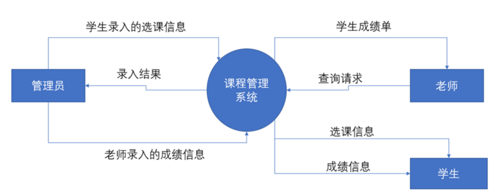
#### 3.4.2. 0层图
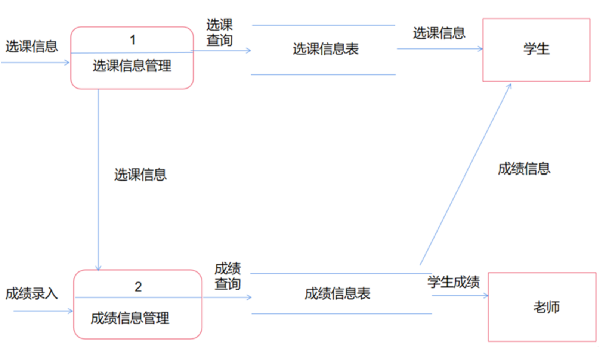

### 3.5学籍管理的业务流程
#### 3.5.1. 顶层图
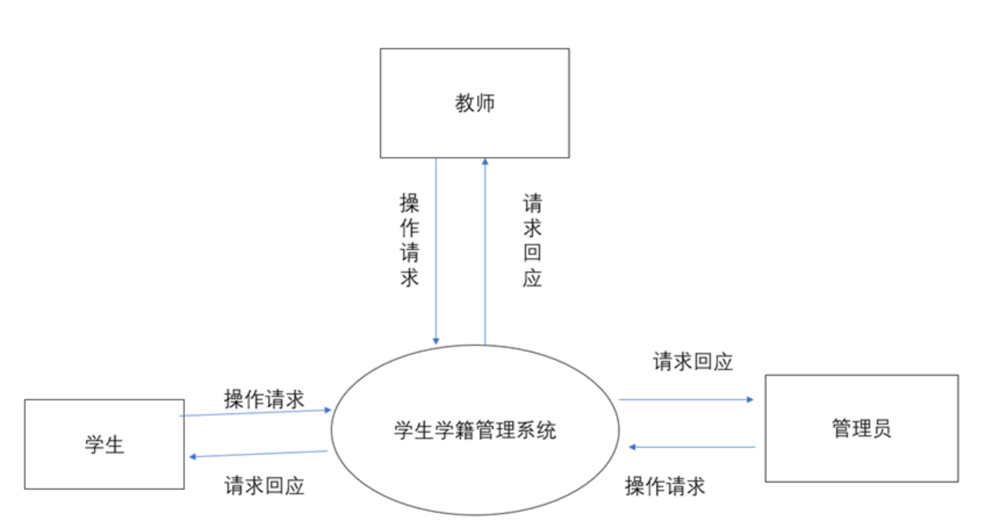
#### 3.5.2. 0层图
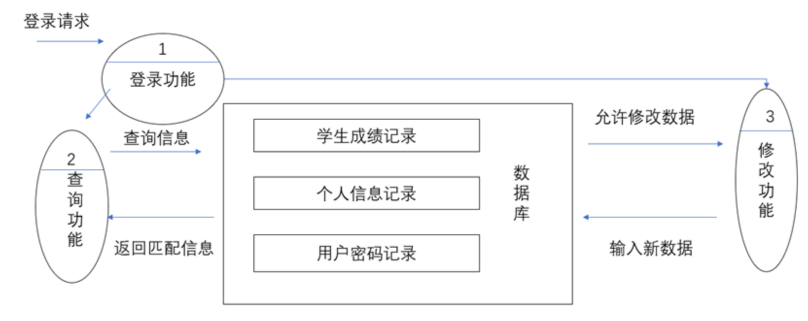
#### 3.5.3. 1层图
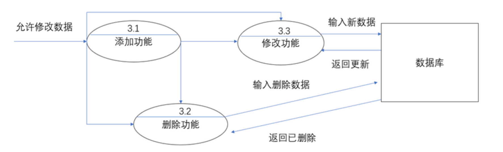

## 四、功能需求
### 4.1功能需求列表
- 成绩管理的功能需求
- 班级管理功能的需求
- 课程管理功能的需求
- 学籍管理功能的需求
- 打印管理功能的需求
  
### 4.2成绩管理的功能需求
学生成绩管理：学生成绩，学生学分，学生课程信息，学生的一般情况，及奖惩、处分情况；老师负责对学生成绩的录入、修改、删除等操作，学生可以查询各科成绩；老师对该模块的功能具有较高权限，学生则只拥有查询的权限，查询成绩的同时还可以将成绩单打印。

### 4.3班级管理功能的需求
学校可以对学生进行分班，然后将分班信息录入数据库，期间还可以对数据库进行修改。老师只能可以查看本班的学生信息，而学生只能查看自己所属的班级信息。

### 4.4课程管理功能的需求
学生选课管理：学生进入系统选择或者退选相应课程；老师向学校提出课程申请，经过学校核查和批准后，将该老师的课程列入课程管理系统，由相应的学工部的工作人员进行排课，排好课后录入该系统。学生和老师都只可以查询课表信息。

### 4.5学籍管理功能的需求
系统管理员负责对学生各种基本信息（包括奖惩情况）的录入、修改、删除等操作；学生学籍管理系统主要用于学校学生学籍的管理，其主要任务是用计算机对学生学籍进行日常管理， 如查询、修改、增加、删除等基本操作。因此，此系统所要完成的功能主要有：学生基础信息管理、学生异动管理、毕业生信息管理等多项管理功能等进行综合管理和快速查询。

### 4.6打印管理功能的需求
对于所有的功能板块的输出信息都可以打印。

## 五、质量与性能要求
### 5.1有关对系统全体要求
#### 5.1.1性能要求

        本系统的性能要求主要是为了能为用户提供充足的信息和快捷的查询手段，用户使用时系统要保证运行稳定、效率高，能够快速做出响应，迅速处理各项数据、信息，显示出所需信息，所以要有一定的可扩展性和灵活性，尽可能的简化用户的操作。

 <u>最主要有以下几点要求：</u>

  ==数据精确度==:

        在数据精确度需求上，根据实际情况，在各项数据的输入、输出及传输过程中，本系统使用了数摞结构，可以满足各种精度的需求。

==时间特性==:
- 响应时间：浏览个人成绩页面需在2秒内完成，浏览班级排名页面需在5秒内完成；

- 系统的数据库较小，所以程序在数据更新处理时间上性能是比较突出的；而且也正由于数据量相对较少，故在数据传输时间和系统运行时间上表现的较好。

==适应性==:

        系统主要使用于高校的局域网，Windows 、XP等环境，连接数据库后，本系统需要DBMS放学生学籍数据库即可；所以，在操作方式、运行环境、与其它软件的接口以及开发计划等发生变化时，系统具有一定的适应能力。

#### 5.1.2质量要求
##### 5.1.2.1可用性要求

        操作方便简洁，要求学生和老师能够灵活的自主操作，系统的可用性强。在装载总程序时，异常就会停止；汉语编程系统若出现错误，将会产生问题，重启，整个终端程序就会再启动；程序出现错误，重新装载；若仍有错，按照提示逐步装载。

##### 5.1.2.2维护性要求

        系统的维护性要求较高，在系统运行过程中，需要对系统进行维护，如修复程序错误、更新软件、修改数据库等，保证系统的正常运行。功能模块间独立强度高，要求易于维护和升级。系统的组成程序为SQL和编程语言，结构均较简单,直观意义上的较独立。

##### 5.1.2.3可靠性要求

        系统数据属于学校内部管理的重要数据，因此除学校管理人员外，其他人员不得访问，要求设有登录密码检验功能，并且此密码可以在以后进行修改；系统有严格的权限管理功能，各功能模块需要有相应的权限方能进入，如学生只能查询自己的信息状况和成绩信息；管理员可以对系统进行日常维护。

### 5.2与各个功能相关的要求
#### 5.2.1性能需求

        各个功能之间的联系密切，模块与模块之间要求高内聚，低耦合，模块间的可重用性强，易于管理。

#### 5.2.2质量要求
##### 5.2.2.1可移植性要求

        系统的可移植的环境是内存需在512MB以上；不可修改任何部分;可用向上兼容的高版本的汉语编程系统。

##### 5.2.2.2可接续性要求

        系统的可接续性要求系统的软件必须提供对系统中各种码表的维护、补充操作。用户必须对系统的材料成本信息进行维护。

##### 5.2.2.3可扩展性要求

        系统的可扩展性强，要求扩展灵活，结构层次分明。

## 六、安全性要求
### 6.1安全性策略

        系统利用数据库本身严密的安全管理机制，采用对重要数据定期自动备份和采用目前比较流行的MD5数据加密算法,并在应用层通过设置合理的使用权限以及必要的操作记录，保证系统抵御来自内部的威胁，防火墙和安全网关技术为系统提供了抵抗外部入侵的能力。系统数据属于学校内部管理的重要数据，因此除学校管理人员外，其他人员不得访问，要求设有登录密码检验功能，并且此密码可以在以后进行修改；系统有严格的权限管理功能，各功能模块需要有相应的权限方能进入，如学生只能查询自己的信息状况和成绩信息；管理员可以对系统进行日常维护

### 6.2防止未经授权的访问
#### 6.2.1防止未经授权侵入的措施

        系统严格采用数据库的安全保护措施，防止数据库的不合法访问和恶意破坏数据库，使用防火墙和安全网关技术，为安全提供了保障。

#### 6.2.2内部用户的访问控制

        对重要数据定期自动备份和采用目前比较流行的MD5数据加密算法,并在应用层通过设置合理的使用权限以及必要的操作记录。

### 6.3信息的保护
#### 6.3.1传输数据的保护

        系统采用数据加密、访问控制等安全机制以确保学籍数据传输和存储的安全，保证系统运行可靠。

#### 6.3.2数据库的保护

        数据库保护设计通常考虑数据完整性、并发控制、数据恢复和数据安全等方面。数据完整性又分为实体完整性、参照完整性、用户定义完整性。数据安全性，采用双重密码保护措施。数据并发性，使用服务器及其操作系统的并发控制机制；解决多个用户，对数据库的并发共享。数据恢复性，定期定时地使用静态海量方式，直接备份学籍管理数据库如果数据库遭到破坏，则可以使用备份数据库进行恢复。

### 6.4系统维护更新设计
  学生信息管理系统，在整个系统的运行过程中，系统的维护和管理是始终贯穿其中的，包括进行==系统应用程序的维护、代码的维护、数据的备份与恢复、硬件设备维==。系统在运行时，也要随着环境的变化根据不同的需求及变化对系统进行必要的修改，使得系统功能更加完善。系统维护工作贯穿于系统的整个运行过程中，包括：系统应用程序的维护、数据的维护、代码的维护、硬件设备维护，系统维护的重点是系统应用软件的维护工作。而系统维护工作不应总是被动的等待用户提出要求后才进行，应进行主动的预防性维护。

## 七、总结：
  本次实验讨论了一个系统的两种分析方法，即==结构化分析方法和面向对象分析方法==，其中最主要的是分析过程的图解和过程分析。通过这次实验，对于一个系统的设计有了很清晰的见解，也明白了需求分析对软件设计的重要性。小组总结得出，本小组将图片过于细化，造成了图片繁多的现象，使之没有很好的体现图片之间的关联，部分关系过于简化，其实可以再改良一些细节，将多个图片融入一个关系当中，由于时间关系，还存在些许问题，不过主要目的是体验这个设计的过程，有所收获就是目标。

    
 
    
    

